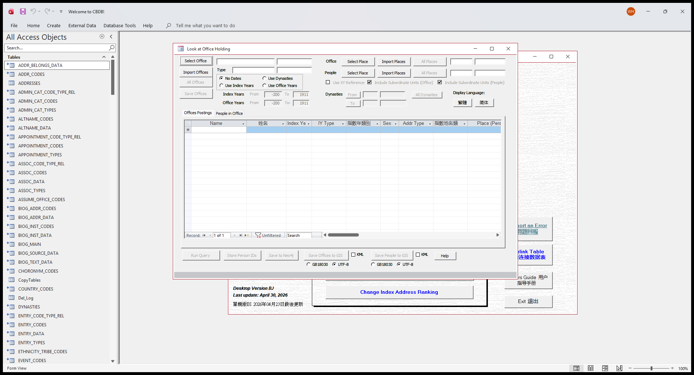

# CBDB User MDB — Issues Report

_A respectful summary of issues uncovered during regression testing._

_Data build: 20260602_

Dear maintainer,

Below is a summary of the issues we uncovered while building an automated regression-test suite for the CBDB User MDB. We hope this report is useful as you continue your wonderful stewardship of this dataset, and we sincerely thank you for the immense work that has gone into building it.

The issues are ordered by severity (P0 highest). Each entry includes a concise description, step-by-step user reproduction, screenshots where the issue is visible in the Access UI, and a suggested fix. None of these are urgent; they are documented so they can be addressed at the maintainer's convenience.

## Coverage Matrix — Form × Button Test Results

| Form | CmdQuery | CmdGIS | CmdNeo4j | CmdPajek | CmdGephi | CmdUCINet | CmdKML | CmdGUESS | CmdRun | CmdUTF8Pajek |
| --- | --- | --- | --- | --- | --- | --- | --- | --- | --- | --- |
| LookAtEntry | ✗ FAIL | ✓ | ✓ | — | — | — | — | — | — | — |
| LookAtStatus | ✓ | ✓ | ✓ | ✗ FAIL | ~ SKIP | ✓ | — | — | — | — |
| LookAtTexts | ✓ | ✓ | ✓ | — | — | — | — | — | — | — |
| LookAtPlace | ✓ | ✗ FAIL | ✗ FAIL | ✓ | ✓ | — | — | — | — | — |
| LookAtAssociations | ✓ | ✓ | ✓ | ✗ FAIL | ✓ | ✗ FAIL | — | — | — | — |
| LookAtOffice | ✓ | ✓ | ✓ | — | — | — | — | ✓ | — | — |
| LookAtKinship | — | ✓ | ✓ | ✓ | — | ✗ FAIL | — | ✗ FAIL | ✓ | ✓ |
| LookAtNetworks | — | — | ~ SKIP | — | — | — | — | — | ~ SKIP | — |
| LookAtGroupData | — | ✓ | ✗ FAIL | — | — | — | — | — | ✗ FAIL | — |
| LookAtAssocPairs | ~ SKIP | ✓ | ✓ | ✓ | — | ✓ | — | — | — | — |

_PASS: 30 · FAIL: 10 · ERROR: 0 · SKIP: 4 · NOT RUN: 0 · N/A: 56_

## Table of Contents

- [P3 — Missing UI](#p3--missing-ui)
  - [Issue #19 — LookAtOffice is missing its CmdGUESS button (handler exists, no UI control)](#issue-19--lookatoffice-is-missing-its-cmdguess-button-handler-exists-no-ui-control)
- [P4 — Setup](#p4--setup)
  - [Issue #2 — VBA project references the legacy dao360.dll, absent on Office 2016+ machines](#issue-2--vba-project-references-the-legacy-dao360dll-absent-on-office-2016-machines)
- [P5 — Dormant / latent / not currently reproducible](#p5--dormant--latent--not-currently-reproducible)
  - [Issue #20 — BOM-prefixed address names can become embedded tabs and misalign GIS exports — DORMANT this build (0 BOM rows in ADDR_CODES)](#issue-20--bom-prefixed-address-names-can-become-embedded-tabs-and-misalign-gis-exports--dormant-this-build-0-bom-rows-in-addr_codes)
  - [Issue #22 — LookAtAssociations.CmdUCINet CreateTextFile lacks the Unicode flag → error 5 on CJK c_name — LATENT (runtime did not fire this build)](#issue-22--lookatassociationscmducinet-createtextfile-lacks-the-unicode-flag--error-5-on-cjk-c_name--latent-runtime-did-not-fire-this-build)
  - [Issue #23 — LookAtAssociations.CmdPajek '*Vertices' header count read from RecordCount before MoveLast (undercounts vertices) — structural metric, P5](#issue-23--lookatassociationscmdpajek-vertices-header-count-read-from-recordcount-before-movelast-undercounts-vertices--structural-metric-p5)
  - [Issue #24 — LookAtKinship GUESS/Gephi .gdf nodedef declares 15 columns but some node rows emit 13 cells — structural metric, P5](#issue-24--lookatkinship-guessgephi-gdf-nodedef-declares-15-columns-but-some-node-rows-emit-13-cells--structural-metric-p5)
- [Severity legend](#severity-legend)
- [Appendix A — c_index_year / c_index_addr_id drift vs the cbdb-online-main-server snapshot (differences need per-row classification before being filed as bugs)](#appendix-a--c_index_year--c_index_addr_id-drift-vs-the-cbdb-online-main-server-snapshot-differences-need-per-row-classification-before-being-filed-as-bugs)
- [Appendix B — TablesFields: documentation vs. actual structure](#appendix-b--tablesfields-documentation-vs-actual-structure)
- [Appendix C — ForeignKeys: documentation vs. actual structure](#appendix-c--foreignkeys-documentation-vs-actual-structure)
- [Closing note](#closing-note)

## Severity legend

- P0 — Silent data corruption: data is wrong or missing without an error popup.
- P1 — Visible runtime crash: a popup appears, the operation aborts.
- P2 — Silent display: form fields render blank when they should show data.
- P3 — Missing UI: a feature exists in code but no button invokes it.
- P4 — Setup: one-time hurdle on each new install.
- P5 — Dormant / latent / not currently reproducible: kept as historical record; we re-checked on the current dump and could not trigger the symptom.

## P3 — Missing UI

### Issue #19 — LookAtOffice is missing its CmdGUESS button (handler exists, no UI control)

**Affected sub:** `LookAtOffice`

**Severity:** P3 — Missing UI (feature unavailable to users).

#### Description

`Form_LookAtOffice.vb` defines a `CmdGUESS_Click` handler (it would write a GUESS `.gdf` export) but LookAtOffice's form design has NO `CmdGUESS` control.  The fresh `control_inventory.json` lists GIS / GISPeople / Neo4j on this form but no GUESS button, so the GUESS export is unreachable from the UI.

#### Steps to reproduce

1. Open LookAtOffice.  There is no GUESS export button (only GIS / GISPeople / Neo4j).
2. Static confirmation: `analysis/dump/control_inventory.json` shows no `CmdGUESS` control on LookAtOffice, although `Form_LookAtOffice.vb` defines `Sub CmdGUESS_Click()`.

#### Screenshots

_LookAtOffice as it ships — no GUESS export button._

_Annotated: `Sub CmdGUESS_Click()` exists in the module but no control invokes it._

#### Suggested fix

Add a CmdGUESS button to LookAtOffice's design, wired to the existing CmdGUESS_Click Sub.

## P4 — Setup

### Issue #2 — VBA project references the legacy dao360.dll, absent on Office 2016+ machines

**Affected sub:** `(VBA project)`

**Severity:** P4 — One-time setup hurdle on each new machine.

#### Description

The shipped .mdb's VBA project carries a hard reference to `C:\Program Files\Common Files\Microsoft Shared\DAO\dao360.dll` — the DAO 3.6 location used by Access 2003.  Modern Office (2016 onward) ships `ACEDAO.DLL` instead and does NOT install the legacy DLL.  On any clean modern machine the first attempt to run a form's code raises 'Can't find project or library', which is opaque and alarming to end users.

Our test driver auto-replaces the broken reference with ACEDAO.DLL when it opens the file (see the before/after reference dump in `analysis/check_vba_refs.py`), so the regression suite does not hit it — but a plain user who double-clicks the shipped .mdb will.  Severity is low because it's a one-time fix per machine, but every fresh install hits it.

#### Steps to reproduce

1. Install `CBDB_BJ_User.mdb` on a fresh modern Office machine.
2. Open the file, then press Alt+F11 to enter the VBE.
3. Tools → References — notice an entry marked `MISSING: dao360.dll`.
4. Open any LookAt form (or otherwise run any form's code).  A 'Can't find project or library' compile-error popup appears before the form's code runs.

#### Suggested fix

Once, on the maintainer's machine: open the .mdb in Access, press Alt+F11, go to Tools → References, untick the MISSING dao360.dll entry, tick `Microsoft Office 16.0 Access Database Engine Object Library` (i.e. ACEDAO.DLL), and save.  Then re-distribute the fixed file — future users won't need to do anything.

## P5 — Dormant / latent / not currently reproducible

_Items in this tier are kept as historical / latent record.  They fall into three categories: (a) DORMANT — verified that current source data doesn't trigger the symptom; (b) NOT CURRENTLY REPRODUCIBLE — the symptom no longer surfaces even though the suspect code is still present (we have NOT confirmed an upstream source-level fix; could be a JET / Office behaviour change, a fixture / driver change on our side, or the original diagnosis was a false positive); (c) LATENT — the source-code defect is real, but the user can't reach it because another issue (e.g. a missing UI button) blocks the path.  None of these are user-facing today; **none have been verified as fixed upstream** — please consult before treating any of them as either urgent or closed._

### Issue #20 — BOM-prefixed address names can become embedded tabs and misalign GIS exports — DORMANT this build (0 BOM rows in ADDR_CODES)

**Affected sub:** `ADDR_CODES + Form_LookAt*.CmdGIS_Click`

**Severity:** P5 — Dormant this build (the export-delimiter defect class is real in code, but the current data has 0 triggering rows).

#### Description

On earlier builds, some `ADDR_CODES` rows carried a stray `U+FEFF` (BOM) prefix in `c_name` / `c_name_chn` (a UTF-8-with-BOM paste residue).  When a CmdGIS export writes each cell as `tStr + value + Chr(9)` with no escaping, the BOM-mangled value can introduce a literal TAB, splitting one field into two cells and silently shifting every column to its right in the `.tab` file.  The fixture that exercised this was status code **40** (civil office / [為官者：文]) in LookAtStatus, with the reachable dirty row `c_addr_id = 702559` (Wei Shi / 尉氏).

Why DORMANT this build: the 20260602 DATA mdb has **0** rows with a literal U+FEFF prefix in ADDR_CODES.c_name or c_name_chn — measured by `tests/test_addr_codes_embedded_delim.py` (build 20260602 calibrated to 0).  The export-delimiter defect class is real in code (the writers still do no escaping), but the current data has 0 triggering rows, so no user can reproduce the misalignment today.  The moment a future data refresh re-introduces a BOM-prefixed (or otherwise tab-bearing) address, the misalignment returns.

#### Steps to reproduce

1. On this build the symptom is dormant — measure the trigger count to confirm:
2. Run `tests/test_addr_codes_embedded_delim.py`; the 20260602 build is calibrated to 0 BOM-prefixed ADDR_CODES rows (the test asserts c_name and c_name_chn both have 0 literal U+FEFF prefixes), and `c_addr_id = 702559` (Wei Shi / 尉氏) exists but carries no BOM.
3. If a future build re-introduces dirty rows, the LookAtStatus GIS export of status code 40 (civil office / [為官者：文]) would again produce a 10-cell line against the 9-column header around the dirty row.

#### Suggested fix

Two complementary fixes, both worth doing.  (1) One-shot data cleanup: strip any leading `U+FEFF` from `ADDR_CODES.c_name` / `c_name_chn` (e.g. `UPDATE ADDR_CODES SET c_name = Mid(c_name, 2) WHERE Left(c_name, 1) = ChrW(65279)` and the parallel statement for c_name_chn) — currently a no-op since 0 rows match, but harmless to keep in the release checklist.  (2) Defensive sanitisation in the export writers: before each `tStr = tStr + value + Chr(9)` append in the CmdGIS bodies, replace any embedded Chr(9/10/13/11/12) or U+FEFF in `value` with a space.  This protects against the next tab-bearing value from any export-bound text field, not just ADDR_CODES.

### Issue #22 — LookAtAssociations.CmdUCINet CreateTextFile lacks the Unicode flag → error 5 on CJK c_name — LATENT (runtime did not fire this build)

**Affected sub:** `Form_LookAtAssociations.CmdUCINet_Click`

**Severity:** P5 — Latent (confirmed missing-Unicode-flag static defect; runtime error 5 not reproduced this non-interactive build, pending UI re-verification).

#### Description

`Form_LookAtAssociations.CmdUCINet_Click` writes the `.vna` export via `Scripting.FileSystemObject.CreateTextFile(tFileName, True)` (line 2580).  The 3rd argument (`Unicode`) is omitted, so it defaults to FALSE — the file opens in the system ANSI code page (cp1252 on en-US Windows).  In the `*node properties` section the body writes `tQuote + !c_name + tQuote`; when `c_name` contains a character with no cp1252 representation (a CJK Han ideograph in particular), `WriteLine` raises VBA error 5 ('Invalid procedure call or argument') and the export aborts, leaving a truncated `.vna` file.  `Form_LookAtKinship.CmdUCINet_Click` has the identical 2-arg pattern at line 2510.

Why LATENT this build: the CmdUCINet button exists, but this non-interactive session could not drive the export, so the runtime error was not reproduced/re-verified.  The missing-Unicode-flag defect is a confirmed static fact; filed as latent pending UI re-verification.  Verified fixture for the trigger: association code `c_assoc_code = 437` (Presented literary composition as gift to / 贈詩、文), whose 1st-order association network includes a person carrying a Han ideograph in c_name.

#### Steps to reproduce

1. On this build the runtime error was not reproduced (non-interactive session).  Verify the missing flag statically:
2. Open `analysis/dump/vba/Form_LookAtAssociations.vb` line 2580: `Set tVNA = tFileSystem.CreateTextFile(tFileName, True)` — only 2 arguments, no Unicode flag.  The same pattern is at `Form_LookAtKinship.vb:2510`.
3. To re-verify interactively later: open LookAtAssociations, pick `c_assoc_code = 437` (Presented literary composition as gift to / 贈詩、文), Run Query, click UCINet, choose a save location — expect a Run-time error 5 popup and a truncated `.vna`.

#### Suggested fix

Add `True` as the 3rd argument of `CreateTextFile` to open the file in Unicode (UTF-16LE) mode at `Form_LookAtAssociations.vb:2580` — `CreateTextFile(tFileName, True, True)` — and apply the same one-line fix to `Form_LookAtKinship.vb:2510`.  Verify UCINET / Visone accept the UTF-16 `.vna` on the fixed build before declaring it closed.

### Issue #23 — LookAtAssociations.CmdPajek '*Vertices' header count read from RecordCount before MoveLast (undercounts vertices) — structural metric, P5

**Affected sub:** `Form_LookAtAssociations.CmdPajek_Click`

**Severity:** P5 — Structural metric (export-header undercount derived by parsing the .net file; not UI-verified this non-interactive build).

#### Description

`Form_LookAtAssociations.CmdPajek_Click` binds the node recordset to a form recordset (`Set tRstNode = ZZ_SCRATCH_P_ASSOC.Form.Recordset`, line 2923), calls `tRstNode.MoveFirst` (line 2928), then writes the Pajek header `tStr = "*Vertices " + Trim(Str(tRstNode.RecordCount))` (line 2929).  On a DAO recordset, `RecordCount` is only the number of rows ACCESSED so far, not the true total, until a `MoveLast` has fully populated it.  Reading it right after `MoveFirst` (with no MoveLast) yields an undercount, so the declared `*Vertices N` header can be far smaller than the actual number of vertex rows the loop subsequently writes.

Finding class is structural_metric: the off-by-N was derived by parsing the exported `.net` header against the emitted vertex-row count, not from a re-verified UI symptom (this build was non-interactive; ui_verified is not set).  Filed at P5.  Demo fixture for the network: person c_personid = 437 (Jia Zhaoming / 賈昭明).

#### Steps to reproduce

1. Verify statically from the dump and the cross-form test:
2. Open `analysis/dump/vba/Form_LookAtAssociations.vb` lines 2923-2929: `tRstNode` is set to the form recordset, `MoveFirst` is called, then `RecordCount` is read for the `*Vertices` header BEFORE any `MoveLast`.
3. The cross-form structural probe `test_vba_pajek_gephi_cross_form` parses the exported `.net` and compares the `*Vertices N` header against the count of vertex rows emitted; the demo network is person c_personid = 437 (Jia Zhaoming / 賈昭明).

#### Suggested fix

Call `tRstNode.MoveLast` (then `MoveFirst`) before reading `RecordCount` at line 2929 so the header reflects the true vertex total, e.g. `tRstNode.MoveLast: tRstNode.MoveFirst: tStr = "*Vertices " + Trim(Str(tRstNode.RecordCount))`.

### Issue #24 — LookAtKinship GUESS/Gephi .gdf nodedef declares 15 columns but some node rows emit 13 cells — structural metric, P5

**Affected sub:** `Form_LookAtKinship.CmdGUESS_Click`

**Severity:** P5 — Structural metric (export nodedef column-count mismatch derived by parsing the .gdf; not UI-verified this non-interactive build).

#### Description

`Form_LookAtKinship.vb`'s GUESS/Gephi `.gdf` writer declares a non-ASCII `nodedef>` header of 15 columns (line 549: name, color, label, labelvisible, style, pinyin, indexyear, sex, addr_name, addr_chn, latitude, longitude, DynastyCode, dynasty, dynasty_chn).  The per-row body (lines 565-650), however, emits a variable number of cells: the non-ASCII dynasty tail (lines 645-649) appends DynastyCode + dynasty + dynasty_chn only when c_dynasty is non-null (line 647) — the `If Not IsNull(!c_dynasty)` at line 646 has NO `Else`, so a node row whose dynasty is null skips those trailing cells entirely and emits fewer cells than the 15-column header, so a strict GDF reader sees a column-count mismatch.

Finding class is structural_metric: the 15-vs-13 mismatch was derived by counting header columns against emitted row cells in the export, not from a re-verified UI symptom (non-interactive build; ui_verified is not set).  Filed at P5.  Demo fixture for the kinship network: person c_personid = 3211 (Zhao Tingmei / 趙廷美).

#### Steps to reproduce

1. Verify statically from the dump and the cross-form test:
2. Open `analysis/dump/vba/Form_LookAtKinship.vb` line 549 — the non-ASCII `nodedef>` header declares 15 columns.  Then read the row body lines 565-650: the non-ASCII dynasty branch (lines 645-649) appends the DynastyCode/dynasty/dynasty_chn cells only when c_dynasty is non-null — the `If Not IsNull(!c_dynasty)` at line 646 has no `Else`, so null-dynasty rows emit fewer cells than the 15-column header.
3. The cross-form structural probe `test_vba_cmdguess_cross_form` parses the `.gdf` header column count against per-row cell counts; the demo network is person c_personid = 3211 (Zhao Tingmei / 趙廷美).

#### Suggested fix

Make every node row emit exactly the 15 cells the header declares.  Normalise the dynasty tail so all branches write DynastyCode + dynasty + dynasty_chn (with empty strings where a value is null) and end each branch with the same trailing-`tC` shape, so the cell count is header-stable on every row.

## Appendix A — c_index_year / c_index_addr_id drift vs the cbdb-online-main-server snapshot (differences need per-row classification before being filed as bugs)

When we compare BIOG_MAIN's `c_index_year` and `c_index_addr_id` between this User MDB and the weekly cbdb-online-main-server SQLite snapshot, a small fraction of persons disagree.

**The two sides are independent implementations.**  The SQLite snapshot's `c_index_year` is produced by cbdb-online-main-server's PHP `IndexYearRebuildService.php` and its `c_index_addr_id` by `IndexAddressRebuildService.php` (both at <https://github.com/cbdb-project/cbdb-online-main-server>); the User MDB-side: `c_index_addr_id` rebuilt by VBA in `Form_frmIndexAddr` (front-end mdb); `c_index_year` rebuilt by **37 saved QueryDefs named `BM IY Rule …`** in the linked-tables backend `data/CBDB_<YYYYMMDD>_DATA.mdb`, driven by `frmBaseMaintenance`.  Both algorithms now extracted to `analysis/dump_data/querydefs_index/*.sql`; form / module driver VBA still needs an interactive Access SaveAsText pass.  PHP is intended to mirror the VBA but they are separate code paths.  Per-row differences can come from at least four sources, and a diff alone doesn't tell us which: (1) source-data snapshot drift; (2) algorithm / porting divergence between PHP and VBA; (3) priority / tie-break differences; (4) null / default handling differences.

The per-row classification of these diffs is in the **Classification summary** below, generated from `reports/index_drift_classification.json` when the classifier has run (placeholder otherwise) — counts and buckets are data-driven, not hardcoded.  The worked example rows further down (`reports/index_drift_examples.json`) illustrate the *shapes* of disagreement; illustrative, not statistically representative, a starting point for per-row triage, not a verdict.

### Classification summary

Compared **657,157** personids common to both databases (User MDB total 658,762; SQLite total 657,478; User-only 1,605; SQLite-only 321).

| Bucket | Count | % of common | Meaning |
|---|---:|---:|---|
| `exact_match` | 656,199 | 99.854% | exact match on all four compared fields |
| `source_drift_index_agrees` | 2 | 0.000% | source drift but indices agreed |
| `source_drift_index_diffs_too` | 30 | 0.005% | source drift AND ≥1 index differs |
| `index_year_only_diff` | 108 | 0.016% | source matched, only c_index_year differs — needs follow-up |
| `index_addr_only_diff` | 796 | 0.121% | source matched, only c_index_addr_id differs — needs follow-up |
| `index_both_diff` | 22 | 0.003% | source matched, both indices differ — strongest signal |

Net diffs: **958** of 657,157 (0.146 %).  Of those, **32** are clearly attributable to source drift in birthyear / deathyear; **926** need per-row follow-up.  These could be PHP↔VBA divergence, or drift in evidence tables (BIOG_ADDR_DATA / ENTRY_DATA / NIAN_HAO etc.) that this classifier does not compare.  Full output: `reports/index_drift_classification.json`; algorithm pointers: `analysis/index_drift_algorithm_notes.md`.

### c_index_addr_id diffs — per-row classification

Of the **818** c_index_addr diffs (478 `index_addr_only_diff` + 10 `index_both_diff` from PR G), each row was classified by re-simulating the rank-priority + MAX(c_sequence) algorithm against each side's BIOG_ADDR_DATA + the shared BIOG_ADDR_CODES rank table.

| Bucket | Count |
|---|---:|
| `mdb_stale_index_addr` | 423 |
| `mdb_value_php_null` | 93 |
| `same_candidates_diff_winner` | 282 |
| `both_stale_recompute_mismatch` | 8 |
| `both_sides_match_recomputed` | 7 |
| `sqlite_stale_index_addr` | 2 |
| `mdb_null_php_value` | 3 |

None of these are confirmed bugs.  The 412 `mdb_stale_index_addr` rows are a maintenance-cadence diff (the User MDB needs its frmBaseMaintenance rebuild re-run before the next release).  The 10 `same_candidates_diff_winner` rows are the only candidate algorithm-divergence rows.  Full per-row output: `reports/index_addr_drift_classification.json`.

PR M (`analysis/dump_data_mdb_vba.py`) extracted `frmBaseMaintenance.CmdIndexAddress_Click` from the DATA mdb.  It does NOT explicitly `MAX(c_sequence)`-aggregate the way PHP does — a candidate algorithmic divergence on top of the maintenance-cadence issue.  Suggested release-checklist mitigation: run `CmdIndexYear` then `CmdIndexAddress` on the DATA mdb before shipping a new User MDB.

PR S (`analysis/deep_dive_addr_same_candidates.py`) confirmed the 10 `same_candidates_diff_winner` rows are all driven by MAX(c_sequence) ties (multiple BIOG_ADDR_DATA rows of the same (person, addr_type) sharing the same max c_sequence).  PHP, Access, and our recompute each pick non-deterministically.  Both sides follow the same documented rule; neither is wrong.  Candidate mitigation: add an explicit secondary tie-break (e.g. MIN(c_addr_id)) to both implementations.  Per-row evidence in `reports/index_addr_same_candidates_deep_dive.json`.

### Examples where only c_index_year disagrees

**`c_personid = 3501` — 李孝稱 (Li Xiaocheng)**

| Field | User MDB | cbdb-online-main-server snapshot |
|---|---|---|
| `c_index_year` | 1018 | 1028 |
| `c_index_addr_id` | 100658 | 100658 |
| `c_birthyear` | 0 | 0 |
| `c_deathyear` | 0 | 0 |
| `c_index_year_type_code` | 19 | 1912 |
| `c_index_year_source_id` | 19149 | 3479 |

**`c_personid = 15971` — 郭世隆 (Guo Shilong)**

| Field | User MDB | cbdb-online-main-server snapshot |
|---|---|---|
| `c_index_year` | 960 |  |
| `c_index_addr_id` | 100658 | 100658 |
| `c_birthyear` | 0 | 0 |
| `c_deathyear` | 0 | 0 |
| `c_index_year_type_code` | 14 |  |
| `c_index_year_source_id` | 24426 |  |

**`c_personid = 16266` — 錢孟回 (Qian Menghui)**

| Field | User MDB | cbdb-online-main-server snapshot |
|---|---|---|
| `c_index_year` | 1004 | 992 |
| `c_index_addr_id` | 12723 | 12723 |
| `c_birthyear` | 0 | 0 |
| `c_deathyear` | 0 | 0 |
| `c_index_year_type_code` | 13 | 0512 |
| `c_index_year_source_id` | 700103 | 3035 |

**`c_personid = 16267` — 錢知雄 (Qian Zhixiong)**

| Field | User MDB | cbdb-online-main-server snapshot |
|---|---|---|
| `c_index_year` | 1034 | 1071 |
| `c_index_addr_id` | 12723 | 12723 |
| `c_birthyear` | 0 | 0 |
| `c_deathyear` | 0 | 0 |
| `c_index_year_type_code` | 1312 | 14 |
| `c_index_year_source_id` | 16266 | 16269 |

**`c_personid = 19771` — 李彭 (Li Peng)**

| Field | User MDB | cbdb-online-main-server snapshot |
|---|---|---|
| `c_index_year` | 1253 |  |
| `c_index_addr_id` | 100185 | 100185 |
| `c_birthyear` | 0 | 0 |
| `c_deathyear` | 0 | 0 |
| `c_index_year_type_code` | 11 |  |
| `c_index_year_source_id` | 40822 |  |

### Examples where only c_index_addr_id disagrees

**`c_personid = 1` — 安惇 (An Dun)**

| Field | User MDB | cbdb-online-main-server snapshot |
|---|---|---|
| `c_index_year` | 1042 | 1042 |
| `c_index_addr_id` | 101117 |  |
| `c_birthyear` | 1042 | 1042 |
| `c_deathyear` | 1104 | 1104 |
| `c_index_year_type_code` | 01 | 01 |
| `c_index_year_source_id` |  |  |

**`c_personid = 470` — 金君卿 (Jin Junqing)**

| Field | User MDB | cbdb-online-main-server snapshot |
|---|---|---|
| `c_index_year` | 1012 | 1012 |
| `c_index_addr_id` | 12879 | 12785 |
| `c_birthyear` | 0 | 0 |
| `c_deathyear` | 0 | 0 |
| `c_index_year_type_code` | 05 | 05 |
| `c_index_year_source_id` |  |  |

**`c_personid = 481` — 周秩 (Zhou Zhi)**

| Field | User MDB | cbdb-online-main-server snapshot |
|---|---|---|
| `c_index_year` | 1043 | 1043 |
| `c_index_addr_id` | 100416 | 12785 |
| `c_birthyear` | 0 | 0 |
| `c_deathyear` | 0 | 0 |
| `c_index_year_type_code` | 05 | 05 |
| `c_index_year_source_id` |  |  |

**`c_personid = 485` — 周穜 (Zhou Tong)**

| Field | User MDB | cbdb-online-main-server snapshot |
|---|---|---|
| `c_index_year` | 1046 | 1046 |
| `c_index_addr_id` | 100416 | 12785 |
| `c_birthyear` | 0 | 0 |
| `c_deathyear` | 0 | 0 |
| `c_index_year_type_code` | 05 | 05 |
| `c_index_year_source_id` |  |  |

**`c_personid = 562` — 范沖 (Fan Chong)**

| Field | User MDB | cbdb-online-main-server snapshot |
|---|---|---|
| `c_index_year` | 1067 | 1067 |
| `c_index_addr_id` | 100658 | 13292 |
| `c_birthyear` | 1067 | 1067 |
| `c_deathyear` | 1141 | 1141 |
| `c_index_year_type_code` | 01 | 01 |
| `c_index_year_source_id` |  |  |

### Examples where the SOURCE data itself differs (birthyear / deathyear)

**`c_personid = 263` — 張穆之 (Zhang Muzhi)**

| Field | User MDB | cbdb-online-main-server snapshot |
|---|---|---|
| `c_index_year` | 1016 |  |
| `c_index_addr_id` |  |  |
| `c_birthyear` | 1016 | 0 |
| `c_deathyear` | 1079 | 0 |
| `c_index_year_type_code` | 01 |  |
| `c_index_year_source_id` |  |  |

**`c_personid = 1455` — 沈邈 (Shen Miao)**

| Field | User MDB | cbdb-online-main-server snapshot |
|---|---|---|
| `c_index_year` | 1001 | 1008 |
| `c_index_addr_id` | 12887 | 12887 |
| `c_birthyear` | 1001 | 0 |
| `c_deathyear` | 1047 | 0 |
| `c_index_year_type_code` | 01 | 05 |
| `c_index_year_source_id` |  |  |

**`c_personid = 19149` — 李孝基 (Li Xiaoji)**

| Field | User MDB | cbdb-online-main-server snapshot |
|---|---|---|
| `c_index_year` | 1016 | 1026 |
| `c_index_addr_id` | 100658 | 100658 |
| `c_birthyear` | 1016 | 0 |
| `c_deathyear` | 1076 | 0 |
| `c_index_year_type_code` | 01 | 11 |
| `c_index_year_source_id` |  | 41030 |

## Appendix B — TablesFields: documentation vs. actual structure

This section compares the contents of the `TablesFields` table in `CBDB_20260602_DATA.mdb` against the database schema reconstructed from Access DAO (TableDefs) by `reports/collect_schema_diffs.py`. Discrepancies indicate the documentation table may be out of date.

Total rows in TablesFields: 875. Reconstructed from DB: 997.

Reconstructed schema: [tables_fields_regen.csv](tables_fields_regen.csv)

### Rows in TablesFields not found in actual DB (stale)

| AccessTblNm | AccessFldNm |
|---|---|
| ADMIN_CAT_CODE_TYPE_REL | c_admin_type_code |
| ADMIN_CAT_TYPES | c_admin_type_code |
| ADMIN_CAT_TYPES | c_admin_type_hz |
| ADMIN_CAT_TYPES | c_admin_type_trans |
| ENTRY_DATA | c_addr_id |
| ENTRY_DATA | c_posting_id |
| MERGED_PERSON_DATA | c_merged_to_personid |
| PersonIDSource | LineNum |
| PersonIDSource | SourceTable |
| TMP_ADDR_C | Max_c_belongs_first_year |

### Columns in actual DB not documented in TablesFields

| AccessTblNm | AccessFldNm | DataFormat | NULL_allowed |
|---|---|---|---|
| ADDRESSES | belongs1_ID | Long | True |
| ADDRESSES | belongs1_Name | Text | True |
| ADDRESSES | belongs2_ID | Long | True |
| ADDRESSES | belongs2_Name | Text | True |
| ADDRESSES | belongs3_ID | Long | True |
| ADDRESSES | belongs3_Name | Text | True |
| ADDRESSES | belongs4_ID | Long | True |
| ADDRESSES | belongs4_Name | Text | True |
| ADDRESSES | belongs5_ID | Long | True |
| ADDRESSES | belongs5_Name | Text | True |
| ADDRESSES | c_addr_cbd | Text | True |
| ADDRESSES | c_addr_id | Long | True |
| ADDRESSES | c_admin_type | Text | True |
| ADDRESSES | c_firstyear | Integer | True |
| ADDRESSES | c_lastyear | Integer | True |
| ADDRESSES | c_name | Text | True |
| ADDRESSES | c_name_chn | Text | True |
| ADDRESSES | x_coord | Double | True |
| ADDRESSES | y_coord | Double | True |
| ADMIN_CAT_CODE_TYPE_REL | c_admin_cat_type_code | Text | False |
| ADMIN_CAT_TYPES | c_admin_cat_type_code | Text | False |
| ADMIN_CAT_TYPES | c_admin_cat_type_hz | Text | False |
| ADMIN_CAT_TYPES | c_admin_cat_type_trans | Text | False |
| ASSOC_DATA | c_tertiary_type_notes | Text | True |
| BIOG_ADDR_DATA | c_delete | Integer | True |
| BIOG_MAIN | c_name_fixed | Text | True |
| CopyTables | NotProcessed | Yes/No | True |
| CopyTables | TableName | Text | False |
| CopyTablesDefault | ID | Long | True |
| CopyTablesDefault | TableName | Text | True |
| ENTRY_DATA | c_entry_addr_id | Long | True |
| ETHNICITY_TRIBE_CODES | c_sortorder | Integer | True |
| ForeignKeys | AccessFldNm | Text | True |
| ForeignKeys | AccessTblNm | Text | True |
| ForeignKeys | DataFormat | Text | True |
| ForeignKeys | FKName | Text | True |
| ForeignKeys | FKString | Text | True |
| ForeignKeys | ForeignKey | Text | True |
| ForeignKeys | ForeignKeyBaseField | Text | True |
| ForeignKeys | IndexOnField | Text | True |
| ForeignKeys | NULL_allowed | Yes/No | True |
| ForeignKeys | skip | Integer | True |
| FormLabels | c_english | Text | True |
| FormLabels | c_fanti | Text | True |
| FormLabels | c_form | Text | True |
| FormLabels | c_jianti | Text | True |
| FormLabels | c_label_id | Integer | True |
| MERGED_PERSON_DATA | c_merged_from_personid | Long | False |
| OFFICE_CODES_CONVERSION | c_office_chn | Text | True |
| OFFICE_CODES_CONVERSION | c_office_chn_backup | Text | True |
| OFFICE_CODES_CONVERSION | c_office_id | Long | True |
| OFFICE_CODES_CONVERSION | c_office_id_backup | Long | True |
| OFFICE_TYPE_TREE_backup | c_office_type_desc | Text | True |
| OFFICE_TYPE_TREE_backup | c_office_type_desc_chn | Text | True |
| OFFICE_TYPE_TREE_backup | c_office_type_node_id | Text | True |
| OFFICE_TYPE_TREE_backup | c_parent_id | Text | True |
| OFFICE_TYPE_TREE_backup | c_tts_node_id | Text | True |
| Paste Errors | c_bibl_cat_code | Long | True |
| Paste Errors | c_created_by | Text | True |
| Paste Errors | c_created_date | Date/Time | True |
| Paste Errors | c_extant | Long | True |
| Paste Errors | c_modified_by | Text | True |
| Paste Errors | c_modified_date | Date/Time | True |
| Paste Errors | c_notes | Memo | True |
| Paste Errors | c_pages | Text | True |
| Paste Errors | c_source | Long | True |
| Paste Errors | c_textid | Long | True |
| Paste Errors | c_text_country | Long | True |
| Paste Errors | c_text_dy | Long | True |
| Paste Errors | c_text_nh_code | Long | True |
| Paste Errors | c_text_nh_year | Long | True |
| Paste Errors | c_text_range_code | Long | True |
| Paste Errors | c_text_type_id | Text | True |
| Paste Errors | c_text_year | Long | True |
| Paste Errors | c_title | Text | True |
| Paste Errors | c_title_alt_chn | Text | True |
| Paste Errors | c_title_chn | Text | True |
| Paste Errors | c_title_trans | Text | True |
| Paste Errors | c_url_api | Text | True |
| Paste Errors | c_url_api_coda | Text | True |
| Paste Errors | c_url_homepage | Text | True |
| POSTED_TO_OFFICE_DATA | c_posting_id_old | Long | True |
| SOCIAL_INSTITUTION_ALTNAME_CODES | c_inst_altname_chn | Text | True |
| SOCIAL_INSTITUTION_ALTNAME_CODES | c_inst_altname_desc | Text | True |
| SOCIAL_INSTITUTION_ALTNAME_CODES | c_inst_altname_type | Integer | True |
| SOCIAL_INSTITUTION_ALTNAME_CODES | c_notes | Text | True |
| SOCIAL_INSTITUTION_ALTNAME_DATA | c_inst_altname_hz | Text | False |
| SOCIAL_INSTITUTION_ALTNAME_DATA | c_inst_altname_py | Text | True |
| SOCIAL_INSTITUTION_ALTNAME_DATA | c_inst_altname_type | Integer | False |
| SOCIAL_INSTITUTION_ALTNAME_DATA | c_inst_code | Integer | False |
| SOCIAL_INSTITUTION_ALTNAME_DATA | c_inst_name_code | Integer | False |
| SOCIAL_INSTITUTION_ALTNAME_DATA | c_notes | Memo | True |
| SOCIAL_INSTITUTION_ALTNAME_DATA | c_pages | Text | True |
| SOCIAL_INSTITUTION_ALTNAME_DATA | c_source | Long | True |
| SOCIAL_INSTITUTION_CODES | c_inst_end_dy | Integer | True |
| SOCIAL_INSTITUTION_CODES | c_inst_end_year | Integer | True |
| SOCIAL_INSTITUTION_CODES_CONVERSION | c_inst_code | Long | True |
| SOCIAL_INSTITUTION_CODES_CONVERSION | c_inst_code_new | Integer | True |
| SOCIAL_INSTITUTION_CODES_CONVERSION | c_inst_name_code | Integer | True |
| SOCIAL_INSTITUTION_CODES_CONVERSION | c_new_new_code | Long | True |
| STATUS_TYPES | c_status_type_parent_code | Text | True |
| TablesFields | AccessFldNm | Text | False |
| TablesFields | AccessTblNm | Text | False |
| TablesFields | DataFormat | Text | True |
| TablesFields | DumpFldNm | Text | True |
| TablesFields | DumpTblNm | Text | True |
| TablesFields | ForeignKey | Text | True |
| TablesFields | ForeignKeyBaseField | Text | True |
| TablesFields | IndexOnField | Text | True |
| TablesFields | NULL_allowed | Yes/No | True |
| TablesFields | RowNum | Long | True |
| TablesFieldsChanges | Change | Text | True |
| TablesFieldsChanges | ChangeDate | Text | True |
| TablesFieldsChanges | ChangeNotes | Text | True |
| TablesFieldsChanges | FieldName | Text | True |
| TablesFieldsChanges | TableName | Text | True |
| TEXT_BIBLCAT_CODES | c_text_cat_level | Text | True |
| TEXT_BIBLCAT_CODES | c_text_cat_parent_id | Text | True |
| TEXT_CODES | c_text_type_id | Text | True |
| TMP_ADDR_C | Min_c_belongs_first_year | Integer | True |
| TMP_ADDR_D | c_addr_cbd | Text | True |
| TMP_ADDR_E | c_addr_cbd | Text | True |
| TMP_DISTANCE_DATA | assoc_xcoord | Double | True |
| TMP_DISTANCE_DATA | assoc_ycoord | Double | True |
| TMP_DISTANCE_DATA | c_assoc_id | Long | False |
| TMP_DISTANCE_DATA | c_distance | Double | True |
| TMP_DISTANCE_DATA | c_personid | Long | False |
| TMP_DISTANCE_DATA | c_t_dist | Double | True |
| TMP_DISTANCE_DATA | x_coord | Double | True |
| TMP_DISTANCE_DATA | y_coord | Double | True |
| ZZZ_DY_DATA | c_dy | Integer | False |
| ZZZ_DY_DATA | c_personid | Long | False |

### Attribute mismatches

Full list: `reports/schema_diff_tables_fields_mismatches.csv` (143 rows)

## Appendix C — ForeignKeys: documentation vs. actual structure

This section covers the `ForeignKeys` table and the FK relationships it documents.

Total rows in ForeignKeys: 188. Reconstructed from DB (via Access.Application DAO): 223.

Reconstructed FK list: [foreign_keys_regen.csv](foreign_keys_regen.csv)

### Rows in ForeignKeys not found in actual DB (stale)

| AccessTblNm | AccessFldNm | ForeignKey | ForeignKeyBaseField |
|---|---|---|---|
| ADDR_BELONGS_DATA | c_source | TEXT_CODES | c_textid |
| assoc_data | c_assoc_day_gz | GANZHI_CODES | c_ganzhi_code |
| assoc_data | c_assoc_nh_code | nian_hao | c_nianhao_id |
| assoc_data | c_assoc_range | year_range_codes | c_range_code |
| assoc_data | c_inst_name_code | SOCIAL_INSTITUTION_NAME_CODES | c_inst_name_code |
| assoc_data | c_inst_name_code,c_inst_code | SOCIAL_INSTITUTION_CODES | c_inst_code |
| biog_addr_data | c_addr_id | ADDR_CODES | c_addr_id |
| biog_addr_data | c_fy_day_gz | GANZHI_CODES | c_ganzhi_code |
| biog_addr_data | c_fy_nh_code | nian_hao | c_nianhao_id |
| biog_addr_data | c_fy_range | year_range_codes | c_range_code |
| biog_addr_data | c_ly_day_gz | GANZHI_CODES | c_ganzhi_code |
| biog_addr_data | c_ly_nh_code | nian_hao | c_nianhao_id |
| biog_addr_data | c_ly_range | year_range_codes | c_range_code |
| biog_addr_data | c_personid | BIOG_MAIN | c_personid |
| biog_addr_data | c_source | TEXT_CODES | c_textid |
| BIOG_INST_DATA | c_inst_name_code | SOCIAL_INSTITUTION_NAME_CODES | c_inst_name_code |
| BIOG_INST_DATA | c_inst_name_code,c_inst_code | SOCIAL_INSTITUTION_CODES | c_inst_code |
| biog_main | c_death_age_range | year_range_codes | c_range_code |
| biog_main | c_index_year_source_id | BIOG_MAIN | c_personid |
| biog_main | c_index_year_type_code | INDEXYEAR_TYPE_CODES | c_index_year_type_code |
| ENTRY_DATA | c_entry_dy | DYNASTIES | c_dy |
| ENTRY_DATA | c_inst_name_code | SOCIAL_INSTITUTION_NAME_CODES | c_inst_name_code |
| ENTRY_DATA | c_inst_name_code,c_inst_code | SOCIAL_INSTITUTION_CODES | c_inst_code |
| EVENTS_ADDR | c_event_code | EVENT_CODES | c_event_code |
| EVENTS_ADDR | c_personid | BIOG_MAIN | c_personid |
| EVENTS_ADDR | c_personid,c_sequence,c_event_code | EVENTS_DATA | c_event_code |
| POSTED_TO_OFFICE_DATA | c_inst_name_code,c_inst_code | SOCIAL_INSTITUTION_CODES | c_inst_code |
| SOCIAL_INSTITUTION_ADDR | c_inst_name_code,c_inst_code | SOCIAL_INSTITUTION_CODES | c_inst_code |

### Columns in actual DB not documented in ForeignKeys

| AccessTblNm | AccessFldNm | ForeignKey | ForeignKeyBaseField |
|---|---|---|---|
| ADDRESSES | c_addr_id | ADDR_CODES | c_addr_id |
| ASSOC_CODES | c_assoc_pair | ASSOC_CODES | c_assoc_code |
| Assoc_data | c_assoc_fy_day_gz | GANZHI_CODES | c_ganzhi_code |
| Assoc_data | c_assoc_fy_nh_code | NIAN_HAO | c_nianhao_id |
| Assoc_data | c_assoc_fy_range | YEAR_RANGE_CODES | c_range_code |
| ASSOC_TYPES | c_assoc_type_parent_id | ASSOC_TYPES | c_assoc_type_code |
| ENTRY_DATA | c_entry_addr_id | ADDR_CODES | c_addr_id |
| EVENTS_DATA | c_event_code | EVENTS_ADDR | c_event_code |
| EVENTS_DATA | c_personid | EVENTS_ADDR | c_personid |
| EVENTS_DATA | c_sequence | EVENTS_ADDR | c_sequence |
| POSTED_TO_OFFICE_DATA | c_inst_code | SOCIAL_INSTITUTION_CODES | c_inst_code |
| POSTED_TO_OFFICE_DATA | c_inst_name_code | SOCIAL_INSTITUTION_CODES | c_inst_name_code |
| SOCIAL_INSTITUTION_ADDR | c_inst_code | SOCIAL_INSTITUTION_CODES | c_inst_code |
| SOCIAL_INSTITUTION_ADDR | c_inst_name_code | SOCIAL_INSTITUTION_CODES | c_inst_name_code |
| SOCIAL_INSTITUTION_CODES | c_inst_end_dy | DYNASTIES | c_dy |

## Closing note

Thank you for taking the time to read this report. None of the items above is urgent; we hope having them all in one place makes it easy to address them at your own pace.

If any of the descriptions or suggested fixes are unclear, we would be glad to discuss further. The corresponding regression tests in this repository will automatically flip from PASS to FAIL the moment any regression marker stops reproducing in the source dump — that is a signal to investigate, not an automatic confirmation that the bug is fixed (the marker could fail because of an upstream fix, a fixture / driver change on our side, or a misclassification we made earlier).
