# CBDB 使用者版 .mdb — 問題彙報

_測試過程中發現的問題彙總，謹呈維護團隊斧正。_

尊敬的維護者：

下面是我們在為 CBDB 使用者版 .mdb 編寫自動化迴歸測試套件過程中，陸續整理出來的一些問題清單。我們希望這份報告能在您繼續主持這份寶貴資料集時有所幫助；同時，對您多年來在這套資料上的辛勤付出，我們由衷地表示感謝和敬意。

問題按嚴重程度排序（P0 最高）。每一條都包括：簡明描述、使用者端一步一步的復現步驟、（在介面上能看到時）相關截圖，以及一份建議的修復方案。這些問題並不緊急，整理在此只是為了方便您在合適的時候逐一處理。

## 目錄

- [P0 — 靜默資料錯誤](#p0--靜默資料錯誤)
  - [Issue #7 — LookAtPlace.CmdNeo4j 在寫入第一條 people-CSV 時靜默失敗](#issue-7--lookatplacecmdneo4j-在寫入第一條-people-csv-時靜默失敗)
  - [Issue #8 — LookAtNetworks.CmdNeo4j 的 people/place CSV 在第一條上靜默失敗](#issue-8--lookatnetworkscmdneo4j-的-peopleplace-csv-在第一條上靜默失敗)
  - [Issue #9 — LookAtEntry.CmdNeo4j 的機構 (Institutions) 部分用錯了記錄集變數](#issue-9--lookatentrycmdneo4j-的機構-institutions-部分用錯了記錄集變數)
  - [Issue #20 — 地址名中的 BOM 會在 GIS 匯出中變成 tab，造成欄位錯位](#issue-20--地址名中的-bom-會在-gis-匯出中變成-tab造成欄位錯位)
- [P1 — 可見的執行時報錯](#p1--可見的執行時報錯)
  - [Issue #6 — LookAtGroupData 的 ChkEntry 路徑引用了不存在的列 ENTRY_DATA.c_parental_status](#issue-6--lookatgroupdata-的-chkentry-路徑引用了不存在的列-entry_datac_parental_status)
  - [Issue #13 — BIOG_MAIN_2 子表單試圖開啟一個不存在的 picker 表單 (frmPickNIAN_HAO)](#issue-13--biog_main_2-子表單試圖開啟一個不存在的-picker-表單-frmpicknian_hao)
- [P2 — 靜默顯示問題](#p2--靜默顯示問題)
  - [Issue #10 — EVENT_ADDR_2 子表單的地址列默默地顯示為空（ControlSource 寫錯了）](#issue-10--event_addr_2-子表單的地址列默默地顯示為空controlsource-寫錯了)
- [P3 — 缺失介面](#p3--缺失介面)
  - [Issue #15 — LookAtPlace 缺少 CmdGIS 按鈕（程式碼裡有 handler 但介面上沒控制元件）](#issue-15--lookatplace-缺少-cmdgis-按鈕程式碼裡有-handler-但介面上沒控制元件)
  - [Issue #16 — LookAtStatus 缺少 CmdPajek 按鈕](#issue-16--lookatstatus-缺少-cmdpajek-按鈕)
  - [Issue #17 — LookAtStatus 缺少 CmdGephi 按鈕](#issue-17--lookatstatus-缺少-cmdgephi-按鈕)
  - [Issue #18 — LookAtStatus 缺少 CmdUCINet 按鈕](#issue-18--lookatstatus-缺少-cmducinet-按鈕)
  - [Issue #19 — LookAtOffice 缺少 CmdGUESS 按鈕](#issue-19--lookatoffice-缺少-cmdguess-按鈕)
- [P4 — 安裝設定](#p4--安裝設定)
  - [Issue #2 — VBA 工程引用了過時的 dao360.dll，Office 2016+ 機器上沒這個檔案](#issue-2--vba-工程引用了過時的-dao360dlloffice-2016-機器上沒這個檔案)
- [P5 — 潛伏 / 不可達 / 當前無法復現](#p5--潛伏--不可達--當前無法復現)
  - [Issue #1 — View_StatusData 會把首年份範圍顯示成末年份範圍 — DORMANT（當前 dump 沒有源資料能觸發）](#issue-1--view_statusdata-會把首年份範圍顯示成末年份範圍--dormant當前-dump-沒有源資料能觸發)
  - [Issue #4 — LookAtPlace.CmdGIS 會報「Object required」 — LATENT，被 Issue #15（表單上沒有 CmdGIS 按鈕）所遮蔽](#issue-4--lookatplacecmdgis-會報object-required--latent被-issue-15表單上沒有-cmdgis-按鈕所遮蔽)
  - [Issue #5 — LookAtStatus.CmdPajek 引用了不存在的控制元件，且 SQL 用了三個不存在的列](#issue-5--lookatstatuscmdpajek-引用了不存在的控制元件且-sql-用了三個不存在的列)
  - [Issue #14 — KIN_DATA 子表單的 CmdPickKinRel 呼叫不存在的 picker（frmPickKINSHIP_CODES）——但目前該子表單在主表中無入口（LATENT）](#issue-14--kin_data-子表單的-cmdpickkinrel-呼叫不存在的-pickerfrmpickkinship_codes但目前該子表單在主表中無入口latent)
  - [Issue #11 — EVENTS_DATA_2 上 c_event_record_id 控制元件綁到不存在的欄位——但該控制元件本身是隱藏的（LATENT）](#issue-11--events_data_2-上-c_event_record_id-控制元件綁到不存在的欄位但該控制元件本身是隱藏的latent)
  - [Issue #12 — POSTED_TO_OFFICE_DATA_2 上 c_appt_type_code 控制元件綁到沒投影的欄位——但該控制元件是隱藏的，且使用者實際看的任職型別欄位是正常的（LATENT）](#issue-12--posted_to_office_data_2-上-c_appt_type_code-控制元件綁到沒投影的欄位但該控制元件是隱藏的且使用者實際看的任職型別欄位是正常的latent)
- [嚴重等級說明](#嚴重等級說明)
- [附錄 —— c_index_year / c_index_addr_id 與 cbdb-online-main-server 快照之間的偏差（差異需要逐筆分類後才能判定是否為缺陷）](#附錄--c_index_year--c_index_addr_id-與-cbdb-online-main-server-快照之間的偏差差異需要逐筆分類後才能判定是否為缺陷)
- [結語](#結語)

## 嚴重等級說明

- P0 — 靜默資料錯誤：資料錯或缺失，但沒有任何報錯提示。
- P1 — 可見的執行時報錯：彈出錯誤對話方塊，操作中斷。
- P2 — 靜默顯示問題：表單欄位本應有資料，卻顯示為空。
- P3 — 缺失介面：程式碼裡實現了某功能，但介面上沒有按鈕去觸發它。
- P4 — 安裝設定：每臺新機器需要一次性處理。
- P5 — 潛伏 / 不可達 / 當前無法復現：保留作為歷史記錄；我們在當前 dump 上重新驗證過，無法再觸發症狀。

## P0 — 靜默資料錯誤

### Issue #7 — LookAtPlace.CmdNeo4j 在寫入第一條 people-CSV 時靜默失敗

**涉及位置:** `Form_LookAtPlace.CmdNeo4j_Click`

**嚴重等級:** P0 — 靜默資料缺失（匯出無聲地什麼都沒生成）

#### 問題描述

`LookAtPlace.CmdNeo4j_Click` 中負責生成 People-CSV 的部分（約第 322 行起）用 SELECT 開啟記錄集，但 SELECT 裡只投影了四個 `ZZ_SCRATCH_P_TEXT` 欄位；接下來的寫入迴圈卻試著讀 `!c_dynasty`、`!c_dynasty_chn`、`!c_female`。迴圈一碰到第一行，JET 立即報「集合中找不到專案」（Item not found in this collection）。錯誤處理把它彈了一個 MsgBox 就結束了，所以使用者只看到一個對話方塊，之後整個 Neo4j 匯出鏈下游的任何檔案都不會產生。

#### 復現步驟

1. 開啟 **LookAtPlace**。透過地址 picker 選一個資料量足夠的地址——例如 **c_addr_id = 7213（開封）**——這樣查詢結果有足夠人物餵給 People-CSV 迴圈。點 **Run Query**。
2. 等查詢跑完，點 **Neo4j** 匯出按鈕。
3. 在第一個另存對話方塊（「People 檔」對話方塊）裡選好儲存路徑。
4. 幾乎立刻彈出 `執行時錯誤 3265 ——集合中找不到專案` 對話方塊。
5. 點確定後，剛才選的資料夾裡一個檔案也沒有——整個 Neo4j 匯出什麼都沒寫出。

#### 截圖

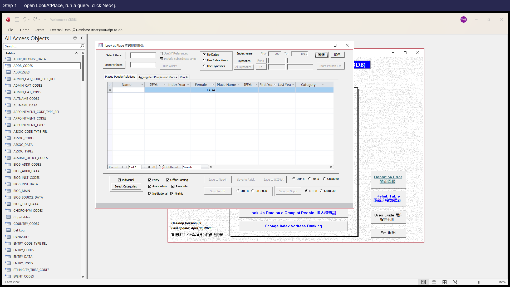

_Step 1 — open LookAtPlace, run any query, click **Neo4j**.  The CmdNeo4j button is in the bottom export-button row; reachability verified against `analysis/dump/control_inventory.json` (LookAtPlace has a `CmdNeo4j` control with the `CmdNeo4j_Click` event bound — re-checked 2026-05-03)._

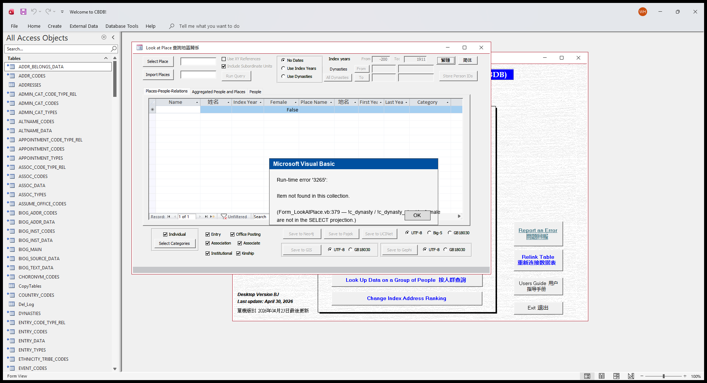

_Step 2 — the popup users see.  Reconstructed in PIL because the real popup would block the COM test driver; the error code (DAO 3265 'Item not found in this collection') and message text come from JET's documented behaviour for a recordset field that isn't in the underlying SELECT._

#### 建議修復方案

把 People-CSV 部分的 SELECT 擴充套件，加入迴圈裡讀到的欄位，例如 `DYNASTIES.c_dynasty`、`DYNASTIES.c_dynasty_chn`、`BIOG_MAIN.c_female`（FROM 子句裡 JOIN 已經把它們暴露出來了）。

### Issue #8 — LookAtNetworks.CmdNeo4j 的 people/place CSV 在第一條上靜默失敗

**涉及位置:** `Form_LookAtNetworks.CmdNeo4j_Click`

**嚴重等級:** P0 — 靜默資料缺失

#### 問題描述

症狀與 Issue #7 相同，只是在另一個表單上。`LookAtNetworks.CmdNeo4j_Click` 中兩條 SELECT 都漏寫了迴圈裡要讀的欄位：

  • `tRstPlace` 的 SELECT（第 2458 行）只投影 3 個欄位，迴圈卻讀 `!x_coord` / `!y_coord`（沒在 SELECT 裡）。
  • `tRstPeoplePlace` 的 SELECT 也漏了 `c_person_id` / `c_index_addr_id`，迴圈要讀它們。

症狀與 Issue #7 完全相同：靜默失敗。

#### 復現步驟

1. 開啟 **LookAtNetworks**（注意：這個表單已知開啟會延遲，請給它幾秒鐘）。
2. 跑一次查詢，然後點 **Neo4j**。
3. 匯出走到 People-with-Place 檔案那一步時，同樣的「Item not found」對話方塊彈出來，之後的檔案都不會再寫了。

#### 截圖

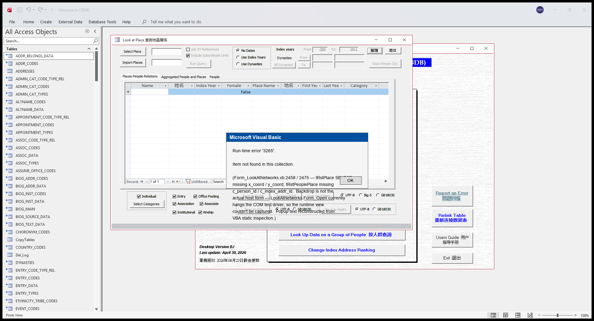

_Reconstructed-in-PIL popup showing the JET 'Item not found in this collection' error users would see.  **Important caveat:** the backdrop in this image is LookAtPlace, NOT LookAtNetworks — LookAtNetworks's `Form_Open` currently hangs the COM test driver, so a real runtime view of the host form couldn't be captured.  The popup text is reconstructed from VBA static inspection of `Form_LookAtNetworks.vb:2458` / `:2475`._

#### 建議修復方案

把兩條 SELECT 都擴充套件，加入迴圈裡讀到的欄位。對 tRstPlace 加上 `ADDR_CODES.x_coord`、`ADDR_CODES.y_coord`。對 tRstPeoplePlace 加上 `c_person_id` 和 `c_index_addr_id`。

### Issue #9 — LookAtEntry.CmdNeo4j 的機構 (Institutions) 部分用錯了記錄集變數

**涉及位置:** `Form_LookAtEntry.CmdNeo4j_Click`

**嚴重等級:** P0 — 靜默資料缺失（匯出無聲地什麼都沒生成）

#### 問題描述

`Form_LookAtEntry.vb` 第 1415 行開啟 institutions 記錄集：`Set tRstInstitutions = CurrentDb.OpenRecordset(tQueryStr)`。十行之後，第 1425 行寫的是 `With tRstAssocCodes`，迴圈又讀 `!c_inst_code`、`!c_inst_name_code` 等，依據的卻是早先繫結到 AssocCodes SELECT 的那個 tRstAssocCodes —— 那裡沒有 `c_inst_*`列。症狀與 Issue #7 相同，InstitutionCodes 檔案永遠不會寫出。

**具體復現** （已對當前 `CBDB_BJ_User.mdb` 驗證）：

在 LookAtEntry 的 picker 選 `c_entry_code = 36`（科舉: 進士（籠統））或 `c_entry_code = 101`（薦舉/保任）。這兩個 entry code 都會產生包含 `c_assoc_code > 0` 之 entry 的查詢結果，使 `tRstAssocCodes` 不為空——具體 personid 見下方 Concrete reproduction 段。點 **Neo4j**，一路確認到 InstitutionCodes 對話方塊；第 1425 行的 `With tRstAssocCodes` 區塊呼叫 `.MoveFirst` 後讀 `!c_inst_code` → DAO 3265（「集合中找不到專案」）彈窗。

**c_inst_code 資料現況補充**：當前 MDB 263 454 筆 ENTRY_DATA 中，`c_inst_code > 0` 的列數為 0；換句話說即使修好這個 bug，InstitutionCodes 檔本來也會是空的。但 bug 本身**在每次走到 InstitutionCodes 分支的 CmdNeo4j 執行時都會觸發**——錯誤的 recordset 變數名與 tRstInstitutions 是否有 row 無關。

#### 復現步驟

1. 開啟 **LookAtEntry**。在 entry-code picker 裡選 `c_entry_code = 36`（科舉: 進士），這個 code 的查詢結果會包含若干 `c_assoc_code > 0` 的 entry，使 `tRstAssocCodes` 不為空。點 **Run Query**。
2. 點 **Neo4j** 匯出按鈕。
3. 前面 6 個 SaveAs 對話方塊（People / PeopleEntry / Place / EntryCodes / KinCodes / AssocCodes）都能正常存檔。
4. 走到 InstitutionCodes 對話方塊時選好儲存位置。第 1425 行的 `With tRstAssocCodes` 區塊先對 AssocCodes 那條 recordset 呼叫 `.MoveFirst`，接著嘗試讀 `!c_inst_code`（這欄根本不在 AssocCodes 的 SELECT 投影裡）。
5. 立即彈出 DAO 3265「集合中找不到專案」對話方塊。按確定後，InstitutionCodes 檔內容為空、未寫入。

#### 具體復現

驗證過的範例—— 以下 personid 在當前 MDB 真實存在，且對所列 `c_entry_code` 都有 `c_assoc_code > 0`，會把 `tRstAssocCodes` 填滿：

  - `c_entry_code = 36`（科舉: 進士）:
      - `c_personid = 32227`  （白居易 / Bai Juyi）  —         c_assoc_code = 559
      - `c_personid = 93384`  （張文伏 / Zhang Wenfu）  —         c_assoc_code = 186

  - `c_entry_code = 101`（薦舉/保任），共 6 筆，包含：
      - `c_personid = 3404`   （胡瑗 / Hu Yuan）
      - `c_personid = 4022`   （吳師仁 / Wu Shiren）
      - `c_personid = 108665` （湯楷 / Tang Kai）

兩個 entry_code 任一個都能復現此 bug。不需要 fixture-side 造資料——這些是當前 dump 裡真實存在的 CBDB 紀錄。

#### 截圖

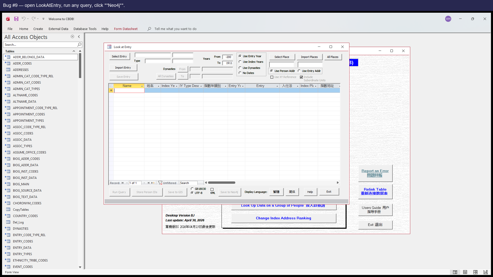

_Step 1 — open LookAtEntry, run any query, click **Neo4j**.  (Note: this code path only fires for queries whose result includes entries with `c_inst_code > 0` — see the summary's REAL_BUT_GATED note.)_

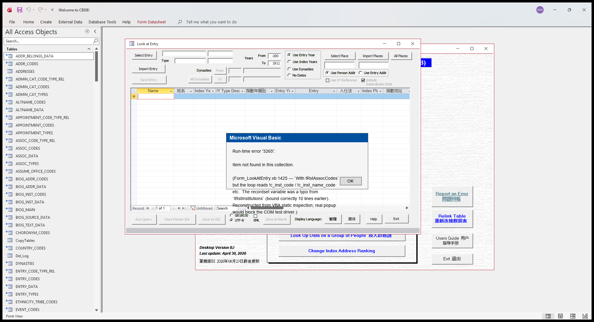

_Step 2 — the popup users see when the With block on line 1425 reads `!c_inst_code` against the wrong-named recordset.  Reconstructed in PIL because the real popup would block the COM test driver; the error code (DAO 3265) and message text are JET's standard response to a recordset field that doesn't exist._

#### 建議修復方案

把第 1425 行的 `With tRstAssocCodes` 改成 `With tRstInstitutions`。屬於一字之差的筆誤，底層記錄集變數只是寫錯了。

### Issue #20 — 地址名中的 BOM 會在 GIS 匯出中變成 tab，造成欄位錯位

**涉及位置:** `ADDR_CODES + Form_LookAt*.CmdGIS_Click`

**嚴重等級:** P0 — 靜默匯出欄位錯位（數字欄位落到文字欄，所有欄位向右挪一格，結尾多出一欄）

#### 問題描述

`ADDR_CODES` 中有 315 行在 `c_name` **和** `c_name_chn` 裡都帶著 `U+FEFF`（BOM）字首，幾乎可以確定是資料匯入時從 UTF-8-with-BOM 文件複製貼上留下的痕跡。當 `LookAtStatus.CmdQuery`（以及其他 LookAt 表單的對應 CmdQuery / CmdRun）把這些行透過 SQL UPDATE/INSERT 複製到自己的 scratch 暫存表時，JET 會先把 BOM 去掉，再把剩下的 UTF-16 LE 位元組重新當成單位元組字元——升回 Unicode 之後值就被破壞了。以 `c_addr_id = 702559`（尉氏）為例，源字串 `尉氏`（UTF-16 位元組 `ff fe 09 5c 0f 6c`）變成了暫存字串 `\t\\\x0fl`（UTF-16 位元組 `09 00 5c 00 0f 00 6c 00`），第 0 位上多了一個**真正的 TAB 字元**。

隨後 `Form_LookAtStatus.CmdGIS_Click`（第 1554–1636 行）把每個欄位寫成 `tStr + value + tC`，其中 `tC = Chr(9)` （第 1552 行）——完全沒有做任何轉義。這個嵌入的 TAB 就被當作分隔符，把 AddrChn 拆成兩欄，往後所有的欄位都悄無聲息地往右挪一格。使用者在 Excel 裡開啟這份 `.tab` 檔，會看到座標落在錯誤的欄位、還多出一個尾欄。LookAtTexts / LookAtPlace / LookAtAssociations / LookAtOffice / LookAtKinship 的 CmdGIS 都用同樣的 `tStr + value + tC` 模式，所以任何 LookAt 表單只要查詢結果裡碰到這 315 個髒地址裡的任何一個，都會重現同樣的欄位錯位。

證據——完整的位元組級追蹤在 `analysis/gis_status_embedded_delim_root_cause.md`；源端掃描在 `reports/gis_embedded_delimiter_findings.json`；實際匯出檔的位元組級 dump 在 `reports/gis_status_export_bytes_dump.json`。迴歸測試 `tests/test_addr_codes_embedded_delim.py` 會在上游資料被清理後**主動失敗**，提醒重新評估。

**已知影響面（PR W）。** 在這 315 行髒 `ADDR_CODES` 裡，**只有 1 行**（`c_addr_id = 702559` / 尉氏）真的被任何人物記錄引用——透過 `BIOG_MAIN.c_index_addr_id` 或 `BIOG_ADDR_DATA`；其餘 314 行在 ADDR_CODES 表裡是孤立的，沒有任何人物掛上去。所以今天的使用者實際影響面其實很小：在 **LookAtStatus**（`c_status_code=40` fixture，正是本 issue 立案的那一行）已有位元組級實證；在 **LookAtKinship**（如果選到那 3 位以阮孚為親屬的人）和 **LookAtPlace**（如果使用者選 `c_addr_id = 702559`）屬於「按源資料看應該會觸達」；在 **LookAtTexts / LookAtAssociations / LookAtOffice** 在當前源資料下根本觸達不到。完整的逐表分析在 `analysis/gis_embedded_delimiter_reach.md` 與 `reports/gis_embedded_delimiter_reach.json`。其餘 314 行是一個**潛伏的資料品質問題**——它們一旦有第一個人物掛上去，就會重現同樣的欄位錯位。前面建議的兩條修法依然都值得做。

#### 復現步驟

1. 開啟 **LookAtStatus**。在 status picker 裡挑 status code **40**（進士），不要設年份過濾——測試 fixture 裡 `FrameFilterYears = 1`。
2. 點 **Run Query**。結果網格里大約填進 17 000 行。
3. 點 **GIS**，把編碼選成 UTF-8（`GISFrame = 1`）。把匯出的 `.tab` 檔存下來。
4. 在任意支援 tab 的工具（Excel / 帶欄位標尺的文字編輯器）裡開啟這個檔。第 **11476** 行附近（對應人物阮孚，`c_addr_id = 702559` / 尉氏）有一行包含 10 個 tab 欄位、卻對著 9 欄的表頭。AddrChn 是空的、X 欄裡塞了文字，真正的 X / Y 值都往右挪了一欄。

#### 建議修復方案

兩條互補的修法，建議都做：

  1. **一次性資料清理。** 把這 315 行 `ADDR_CODES.c_name` / `c_name_chn` 開頭的 `U+FEFF` 去掉（例如 `UPDATE ADDR_CODES SET c_name = Mid(c_name, 2) WHERE Left(c_name, 1) = ChrW(65279)`，再對 `c_name_chn` 重複一遍）。這一步可以立即解決使用者能看到的欄位錯位。

  2. **匯出端做防禦性 sanitisation。** 在 LookAtStatus / Texts / Place / Associations / Office / Kinship 各自的 CmdGIS 裡，每一個 `tStr = tStr + value + tC` 之前，先把 `value` 裡的 Chr(9)、Chr(10)、Chr(13)、Chr(11)、Chr(12)、`U+FEFF` 全部替換成空格。這樣以後任何 text 欄位如果再混進類似的髒字符，匯出依然能保持欄位對齊——少了這一層，下一次只要 `ADDR_CODES.c_name`（或 `BIOG_MAIN.c_name`、或其他這些匯出會碰到的 text 欄位）裡悄悄塞進一個 tab 字元，又會重現完全一樣的靜默錯位。

  3. **建議增加一個釋出前的檢查指令碼。** 寫一個簡短的指令碼，釋出前掃描所有會被匯出的 text 欄位，看裡面有沒有分隔符或控制字元，可以在每次釋出前提前抓到這一類髒資料問題。`analysis/probe_status_gis_embedded_delim.py` 是一個現成的起點。

## P1 — 可見的執行時報錯

### Issue #6 — LookAtGroupData 的 ChkEntry 路徑引用了不存在的列 ENTRY_DATA.c_parental_status

**涉及位置:** `Form_LookAtGroupData.queryEntry`

**嚴重等級:** P1 — 常用路徑上的可見報錯（Entry 子查詢）

#### 問題描述

`Form_LookAtGroupData.vb` 第 2621 行的 INSERT INTO 目標列裡寫的是 `c_parental_status_code`，但 SELECT 投影寫的是 `ENTRY_DATA.c_parental_status`（少了 `_code` 字尾）。`ENTRY_DATA` 上真實列名是 `c_parental_status_code`；這個筆誤讓使用者一旦勾上 **Entry** 子型別再點 **Run**，SQL 就會報「無此欄位」。

`Form_LookAtEntry.vb:1650` 寫的是同一段邏輯查詢而且名字是對的，可以參考。

#### 復現步驟

**建議使用的範例人物：** `c_personid=1`（安惇，An Dun）

用人物 1（安惇，An Dun）當匯入清單（資料少、只有 2 條 entry 記錄，方便復現）。在 LookAtGroupData 上只勾 **Entry**，點 **Run**。 _由 `reports/probe_demo_persons.py` 透過 SQL probe 挑選；之所以選這位，是因為其底層記錄數確實滿足這個 bug 的觸發條件。_

1. 在 **LookAtGroupData** 上把匯入清單設為一個人——例如 c_personid = 1（安惇 An Dun），他只有 2 條 ENTRY_DATA 記錄，足以讓有缺陷的 queryEntry SQL 在一個小而熟知的樣本上跑起來。
2. **只**勾 **Entry** 核取方塊（Status / Office / Text / Addr 都不勾，避免無關的查詢分支幹擾）。
3. 點 **Run**。
4. 彈出「欄位不存在」之類的對話方塊（JET 在不同 Office 版本下給出的措辭是「沒有為一個或多個必要引數提供值」或「沒有此欄位」——都是因為 SQL 引用了根本不存在的 `ENTRY_DATA.c_parental_status`）。

#### 截圖

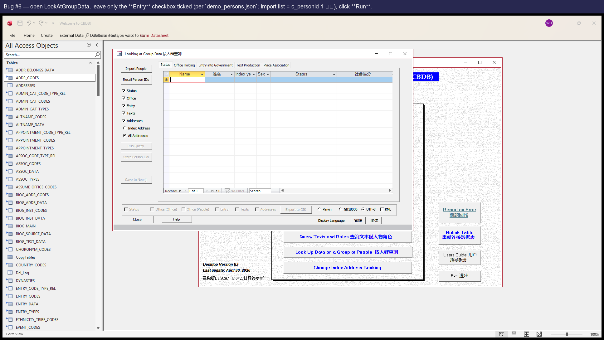

_Step 1 — open LookAtGroupData, leave only the Entry checkbox ticked, click Run.  (Demo input from `reports/demo_persons.json`: import list = c_personid 1, 安惇.)_

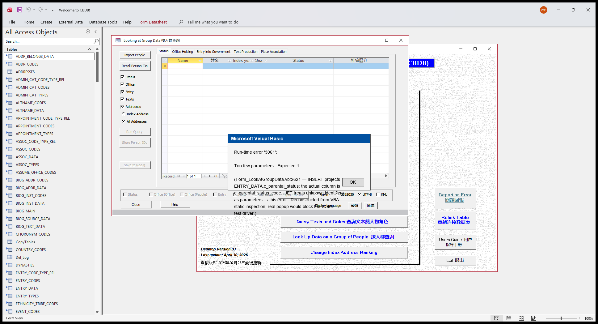

_Step 2 — the JET error popup users see.  The popup graphic is reconstructed in PIL because the real popup would block the COM test driver; the error code (3061) and message text come from JET's documented behaviour for unknown-identifier-as-parameter on the line cited in the summary._

#### 建議修復方案

把第 2621 行的 `ENTRY_DATA.c_parental_status` 改成 `ENTRY_DATA.c_parental_status_code`。一行修復。

### Issue #13 — BIOG_MAIN_2 子表單試圖開啟一個不存在的 picker 表單 (frmPickNIAN_HAO)

**涉及位置:** `Form_BIOG_MAIN_2_Subform.c_fl_ey_notes_Click`

**嚴重等級:** P1 — 使用者點選時可見的報錯

#### 問題描述

使用者在某位人物生平詳情子表單上點選 `c_fl_ey_notes` 欄位時，`Sub c_fl_ey_notes_Click` 會呼叫 `DoCmd.OpenForm "frmPickNIAN_HAO"`。.mdb 的 CurrentProject.AllForms 集合中並沒有名為 `frmPickNIAN_HAO` 的表單。Access 報「集合中找不到專案」，使用者的這一次點選就此無效。

可能原因：picker 表單在某次重構中被重新命名或合併了，而這個呼叫處沒有跟著更新。

#### 復現步驟

**建議使用的範例人物：** `c_personid=5`（查籥，Zha Yue）

開啟人物 5（查籥，Zha Yue）。其 `c_fl_ey_notes` 欄位有真實內容（樣例：「紹興二十一年進士。…」），所以點選它會真的觸發這個有缺陷的 Sub。 _由 `reports/probe_demo_persons.py` 透過 SQL probe 挑選；之所以選這位，是因為其底層記錄數確實滿足這個 bug 的觸發條件。_

1. 開啟人物 **c_personid = 5（查籥 Zha Yue）** 的生平詳情——之所以選他，是因為其 BIOG_MAIN 上 `c_fl_ey_notes` 欄位有實際內容，欄位可點（點一個空欄位不會觸發這個 Sub）。
2. 在 BIOG_MAIN_2 子表單上點 `c_fl_ey_notes` 欄位——這會觸發 `c_fl_ey_notes_Click` Sub。
3. 彈出「集合中找不到專案」對話方塊（因為 Sub 試圖 `DoCmd.OpenForm "frmPickNIAN_HAO"`，而該表單根本不存在）。

#### 截圖

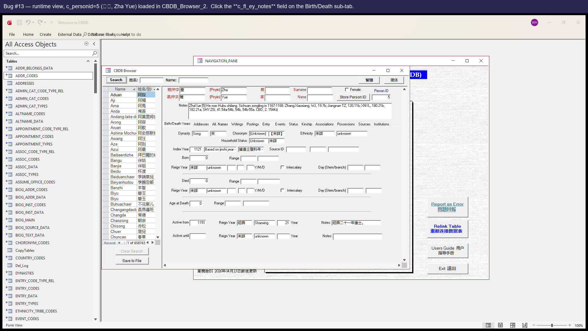

_Step 1 — open CBDB_Browser_2, navigate to c_personid=5 (查籥 Zha Yue), click the `c_fl_ey_notes` field on the Birth/Death sub-tab (this fires `c_fl_ey_notes_Click`)._

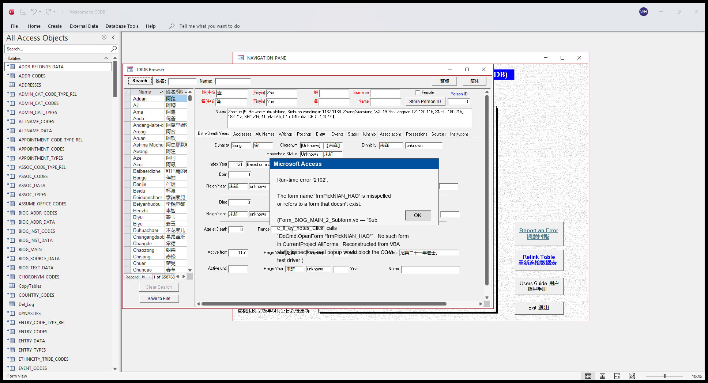

_Step 2 — the popup users see.  Reconstructed in PIL because the real popup would block the COM test driver; error 2102 + 'misspelled or refers to a form that doesn't exist' is Access's standard message when DoCmd.OpenForm targets a form not in CurrentProject.AllForms._

#### 建議修復方案

要麼把 `frmPickNIAN_HAO` 表單恢復回來，要麼在 `Form_BIOG_MAIN_2_Subform.c_fl_ey_notes_Click` 裡把呼叫改成替代的那個 picker 表單。

## P2 — 靜默顯示問題

### Issue #10 — EVENT_ADDR_2 子表單的地址列默默地顯示為空（ControlSource 寫錯了）

**涉及位置:** `EVENT_ADDR_2 Subform`

**嚴重等級:** P2 — 靜默顯示問題（EVENT_ADDR_2 的 TxtAddrCHN / TxtAddrPY 每一列都空白）

#### 問題描述

在 EVENT_ADDR_2 子表單（帶地址的事件）上，兩個地址控制元件的繫結如下：

  • `TxtAddrCHN`.ControlSource = `c_name_chn`
  • `TxtAddrPY`.ControlSource = `c_name`

但該表單的 RecordSource 是存檔查詢 `View_EventAddrData`，裡面把 ADDR_CODES.c_name_chn 起別名成 `c_event_addr_chn`、把 ADDR_CODES.c_name 起別名成 `c_event_addr_name`。投影裡既沒有 `c_name` 也沒有 `c_name_chn`，所以這兩個控制元件每一行都默默地顯示為空。

#### 復現步驟

**建議使用的範例人物：** `c_personid=44872`（孫才，Sun Cai）

開啟人物 44872（孫才，Sun Cai）。EVENTS 子資料表會顯示 1 條事件，其中 1 條有對應地址。相關繫結控制元件在每一列都會顯示空白。 _由 `reports/probe_demo_persons.py` 透過 SQL probe 挑選；之所以選這位，是因為其底層記錄數確實滿足這個 bug 的觸發條件。_

1. 開啟 CBDB_Browser_2，導航到 **c_personid = 44872（孫才 Sun Cai）**——選他是因為他有 1 條 EVENTS_DATA 記錄，對應 1 條 EVENT_ADDR 指向 `c_addr_id = 12603`（ADDR_CODES 裡是 Anfeng / 安豐）。切到 **Events** 子分頁。
2. 看事件那行內嵌的 EVENT_ADDR_2 子表單（在主事件那行下方的一小條）。那裡的兩個位址列位 `TxtAddrCHN` 與 `TxtAddrPY` 都是空白。
3. **注意：**外層的 EVENTS_DATA_2 子表單也有自己的位址列位（也叫 TxtAddrCHN / TxtAddrPY，但是綁到 `c_addr_chn` / `c_addr_name`，這兩個 `View_EventsData` 確實有 project）——這兩個欄位是正常的，會顯示「安豐 / Anfeng」。Bug #10 講的是內層 EVENT_ADDR_2 那兩個空欄位，不是父層那條看得見的地址值。
4. SQL 驗證（不需開 Access）：`SELECT c_name_chn FROM View_EventAddrData` 會拋 `Too few parameters. Expected 2.`——JET 把未知識別字當作引數對待，這就確認了該欄位不在投影裡。

#### 截圖

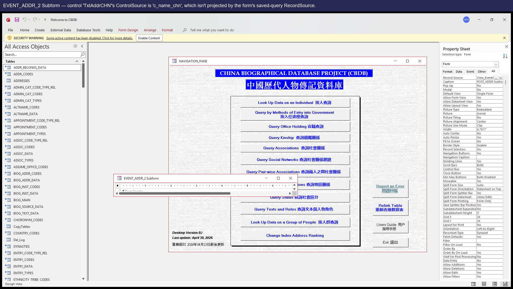

_Runtime view of CBDB_Browser_2 → BIOG_MAIN_2 → Events tab with c_personid=44872 (孫才) loaded.  **The visible '安豐' / address values come from the parent EVENTS_DATA_2 sub-form's TxtAddrCHN (correctly bound to `c_addr_chn`).**  Bug #10's blank controls live in the smaller EVENT_ADDR_2 sub-form nested inside the event row — those two controls (TxtAddrCHN / TxtAddrPY bound to `c_name_chn` / `c_name`, neither in `View_EventAddrData`'s projection) render empty.  COM probe confirms both are Visible=True with widths 2340 / 2100 twips (≈4cm / 3.5cm) — i.e. real user-visible blank columns, just smaller than the parent row's address display.  Verification scripts: `analysis/probe_bug_10_11_12_visibility.py` (control visibility) + the SQL probe in the steps above._

#### 建議修復方案

在 `EVENT_ADDR_2 Subform` 的表單設計檢視裡，把 `TxtAddrCHN`.ControlSource 由 `c_name_chn` 改成 `c_event_addr_chn`；把 `TxtAddrPY`.ControlSource 由 `c_name` 改成 `c_event_addr_name`（這才是 View_EventAddrData 裡真實的別名）。

## P3 — 缺失介面

### Issue #15 — LookAtPlace 缺少 CmdGIS 按鈕（程式碼裡有 handler 但介面上沒控制元件）

**涉及位置:** `LookAtPlace`

**嚴重等級:** P3 — 缺失介面（使用者用不到該功能）

#### 問題描述

`Form_LookAtPlace.vb` 裡定義了一個完整可用的 `CmdGIS_Click` handler——構造並輸出 GIS .tab 檔案，邏輯和 Status / Texts / Associations / Office / Kinship 上的 GIS 按鈕一模一樣。但 LookAtPlace 的設計檢視上根本沒有 `CmdGIS` 按鈕。使用者在 Place 上可以使用 Pajek / Gephi / Neo4j 匯出，但用不了 GIS 匯出——程式碼在那裡，只是介面進不去。

#### 復現步驟

1. 開啟 **LookAtPlace**。
2. 看右下方那一排匯出按鈕。
3. 沒有 GIS 按鈕。可以對比 LookAtStatus / LookAtAssociations / LookAtOffice 等，它們都有這個按鈕。

#### 截圖

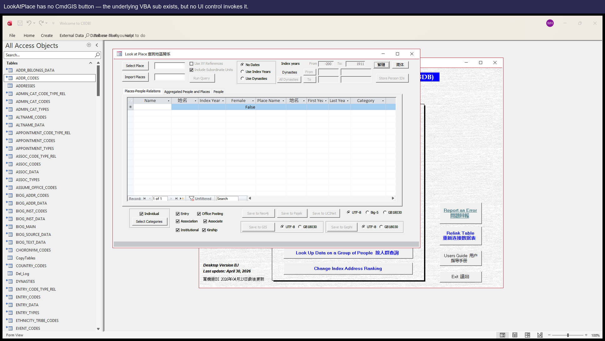

_LookAtPlace as it ships — no GIS button is rendered, even though `Sub CmdGIS_Click()` exists in the module._

#### 建議修復方案

在 LookAtPlace 的設計視圖裡，在已有的 CmdPajek / CmdGephi 旁邊加一個 CmdGIS 按鈕，把 `OnClick` 設為 `[Event Procedure]`，這樣它就會呼叫已經寫好的 CmdGIS_Click。（同時務必先修 Issue #4，否則按鈕一點就會報 Object required。）

### Issue #16 — LookAtStatus 缺少 CmdPajek 按鈕

**涉及位置:** `LookAtStatus`

**嚴重等級:** P3 — 缺失介面

#### 問題描述

形態與 Issue #15 相同。`Sub CmdPajek_Click()` 在 `Form_LookAtStatus.vb` 裡有定義（本應輸出 Pajek .net 檔案），但 Status 的設計檢視上沒有 CmdPajek 按鈕。

注意：即便把按鈕加回去，也得先解決 Issue #5（CmdPajek_Click 本身的 SQL/控制元件缺陷）。

#### 復現步驟

1. 開啟 **LookAtStatus**。匯出按鈕一欄只有 GIS 和 Neo4j，沒有 Pajek。

#### 截圖

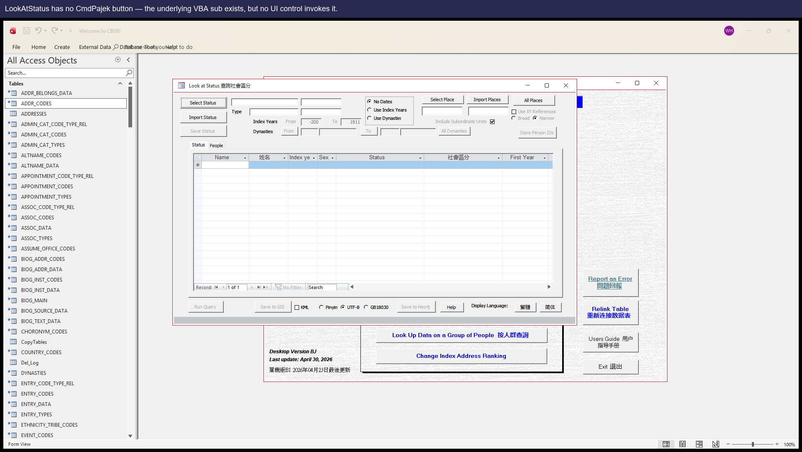

#### 建議修復方案

在 LookAtStatus 的設計視圖裡加一個 CmdPajek 按鈕（先把 Issue #5 修好）。

### Issue #17 — LookAtStatus 缺少 CmdGephi 按鈕

**涉及位置:** `LookAtStatus`

**嚴重等級:** P3 — 缺失介面

#### 問題描述

`Sub CmdGephi_Click()` 在 `Form_LookAtStatus.vb` 裡有定義，但表單設計視圖裡沒有相應按鈕。

#### 復現步驟

1. 開啟 **LookAtStatus**。沒有 Gephi 匯出按鈕。

#### 截圖

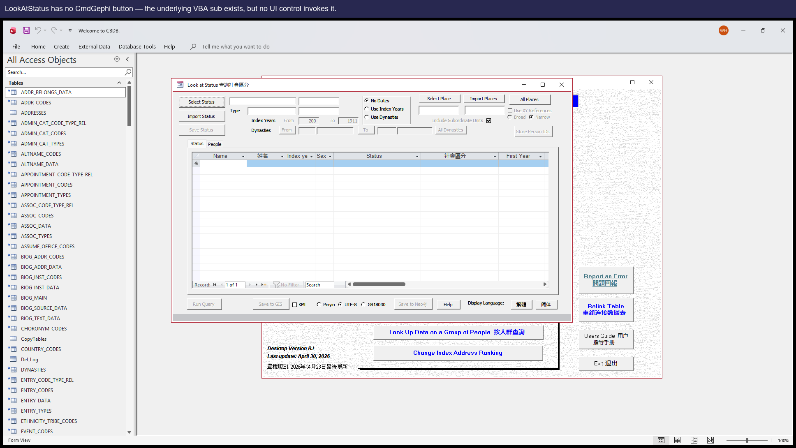

#### 建議修復方案

在 LookAtStatus 的設計視圖裡加一個 CmdGephi 按鈕。

### Issue #18 — LookAtStatus 缺少 CmdUCINet 按鈕

**涉及位置:** `LookAtStatus`

**嚴重等級:** P3 — 缺失介面

#### 問題描述

`Sub CmdUCINet_Click()` 在 `Form_LookAtStatus.vb` 裡有定義，但表單設計視圖裡沒有相應按鈕。

#### 復現步驟

1. 開啟 **LookAtStatus**。沒有 UCINet 匯出按鈕。

#### 截圖

#### 建議修復方案

在 LookAtStatus 的設計視圖裡加一個 CmdUCINet 按鈕。

### Issue #19 — LookAtOffice 缺少 CmdGUESS 按鈕

**涉及位置:** `LookAtOffice`

**嚴重等級:** P3 — 缺失介面

#### 問題描述

`Sub CmdGUESS_Click()` 在 `Form_LookAtOffice.vb` 裡有定義，但 Office 的設計檢視上沒有 CmdGUESS 按鈕。Office 上的使用者可以使用 GIS / GISPeople / Neo4j 匯出，但用不了 GUESS。

#### 復現步驟

1. 開啟 **LookAtOffice**。沒有 GUESS 匯出按鈕。

#### 截圖

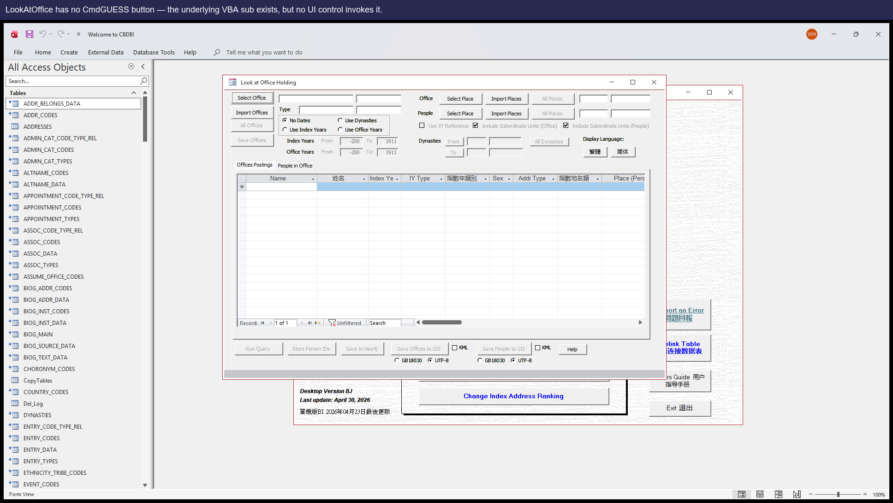

#### 建議修復方案

在 LookAtOffice 的設計視圖裡加一個 CmdGUESS 按鈕。

## P4 — 安裝設定

### Issue #2 — VBA 工程引用了過時的 dao360.dll，Office 2016+ 機器上沒這個檔案

**涉及位置:** `VBE Project References`

**嚴重等級:** P4 — 每臺新機器一次性的安裝障礙

#### 問題描述

.mdb 中的 VBA 工程硬性引用了 `C:\Program Files\Common Files\Microsoft Shared\DAO\dao360.dll`，這是 Access 2003 時代 DAO 3.6 的位置。現代 Office（2016 起）改用 `ACEDAO.DLL`，並不會安裝舊版 DLL。在任何全新的現代機器上，第一次嘗試開啟任意 LookAt 表單都會報「找不到工程或庫」（Can't find project or library），對終端使用者來說既看不懂又嚇人。

嚴重等級較低，因為每臺機器只需修一次，但每臺新裝都會撞上。

#### 復現步驟

1. 在全新的現代 Office 機器上安裝 `CBDB_BJ_User.mdb`。
2. 開啟檔案，按 Alt+F11 進入 VBE 編輯器。
3. 工具 → 引用。可以看到一行寫著 `MISSING: dao360.dll`。
4. 開啟任意 LookAt 表單。會彈出「Can't find project or library」錯誤。

#### 建議修復方案

在維護者的機器上做一次：
  1. 用 Access 開啟 .mdb，按 Alt+F11。
  2. 工具 → 引用。取消勾選標著 MISSING 的 dao360.dll。
  3. 勾選 `Microsoft Office 16.0 Access Database Engine Object Library`（即 ACEDAO.DLL）。
  4. 儲存 .mdb。

然後重新分發修好的檔案。以後的終端使用者什麼都不用做。

## P5 — 潛伏 / 不可達 / 當前無法復現

_本層的條目作為歷史 / 潛伏記錄保留。可分為三類：(a) DORMANT 潛伏 — 已驗證當前源資料無法觸發該症狀；(b) 當前無法復現 — 症狀不再出現，但可疑程式碼仍在（我們**沒有**確認上游有原始碼層面的修復；原因可能是 JET / Office 的行為改變、可能是我們這邊 fixture/driver 改變，也可能原本的診斷就是 false positive）；(c) LATENT 被遮蔽 — 原始碼缺陷確實存在，但因為另一個 issue（例如某個 UI 按鈕缺失）擋住了使用路徑，使用者目前碰不到。本層條目當下都不是使用者會遇到的問題，**也沒有任何一條被確認上游修復**；若要當成緊急或已關閉處理，請先諮詢。_

### Issue #1 — View_StatusData 會把首年份範圍顯示成末年份範圍 — DORMANT（當前 dump 沒有源資料能觸發）

**涉及位置:** `View_StatusData`

**嚴重等級:** P5 — 在當前 dump 上潛伏（若任何 STATUS_DATA 列同時填了 fy/ly range 且不同，會升為 P0）

#### 問題描述

存檔查詢 `View_StatusData` 把 `YEAR_RANGE_CODES` 表 JOIN 了兩次（其中一次別名是 `YEAR_RANGE_CODES_1`，用於末年份範圍），但 SELECT 列表裡所有範圍欄位都從 _1 別名取值。結果是 Status 子資料表裡每一行顯示的「首年份範圍」其實是末年份範圍。

#### 復現步驟

⚠ **在當前資料快照下無法在 UI 上復現——請看下方說明**

在當前資料快照下，這個 bug 處於 **潛伏 (dormant) 狀態**——STATUS_DATA 共 70,761 行，但只有 13 行 c_fy_range > 0、0 行 c_ly_range > 0；兩個都有值且不同的只有 0 行。所以目前沒有任何人物能在 UI 上重現這個別名錯位。SQL 缺陷仍然存在；只要未來某次資料更新插入一條 fy/ly range 都填了且不同的 STATUS_DATA 記錄，對應的子資料表那一行就會顯示錯誤文字。今天若要驗證這個 bug，可以直接跑 SQL：
  SELECT c_personid, c_fy_range, c_fy_range_desc, c_ly_range, c_ly_range_desc FROM View_StatusData WHERE c_fy_range > 0 OR c_ly_range > 0;

1. 由於本 .mdb 當前快照下，沒有任何 STATUS_DATA 列同時填了 c_fy_range 和 c_ly_range，這個 bug 暫時無法在 UI 上復現。請直接用 SQL 驗證：
2. 在 Access 裡開啟 .mdb，按 F11 顯示導航窗格，雙擊查詢 **View_StatusData**。
3. 檢視 SELECT 子句：所有 `c_fy_range_*` 別名都從 `YEAR_RANGE_CODES_1` 取值，但 FROM 子句把這個別名 JOIN 在末年份範圍上——這就是錯位。
4. （可選）在 Access 查詢視窗執行 `SELECT TOP 100 c_personid, c_fy_range, c_fy_range_desc, c_ly_range, c_ly_range_desc FROM View_StatusData WHERE c_fy_range > 0 OR c_ly_range > 0` ——未來某次資料更新如果同時填了這兩個欄位且取值不同，每一條結果都會顯示錯誤的首年份文字。

#### 建議修復方案

在 `View_StatusData` 中，把 `YEAR_RANGE_CODES_1.c_range AS c_fy_range_desc` 和 `YEAR_RANGE_CODES_1.c_range_chn AS c_fy_range_chn` 改成不帶別名的 `YEAR_RANGE_CODES.*`（FROM 子句已經按 `c_fy_range` JOIN 了它）。

### Issue #4 — LookAtPlace.CmdGIS 會報「Object required」 — LATENT，被 Issue #15（表單上沒有 CmdGIS 按鈕）所遮蔽

**涉及位置:** `Form_LookAtPlace.CmdGIS_Click`

**嚴重等級:** P5 — 潛伏（若先修了 Issue #15 而沒同時修本條，會變成 P1）

#### 問題描述

說明：在當前 .mdb 上這個問題暫時不會被使用者觸發，因為 LookAtPlace的設計視圖裡根本沒有 CmdGIS 按鈕（即 Issue #15）——使用者無法點選。但底層 VBA 問題依然存在：`Form_LookAtPlace.vb` 第 1539 行寫的是 `If GISFrame.Value = 1 Then`，而該表單上根本沒有 `GISFrame` 控制元件（真正的編碼選擇控制元件叫 `CodeFrame`）。一旦 Issue #15 裡把缺失的按鈕加回去而沒先修這一行，每一次點選都會拋錯。

#### 復現步驟

1. （在 Issue #15 修好之後才能復現）開啟 **LookAtPlace**。
2. 跑任意一次查詢。
3. 點 GIS 按鈕。
4. 彈出 `執行時錯誤 424 ——必要的物件（Object required）` 對話方塊，匯出什麼都沒做。

#### 截圖

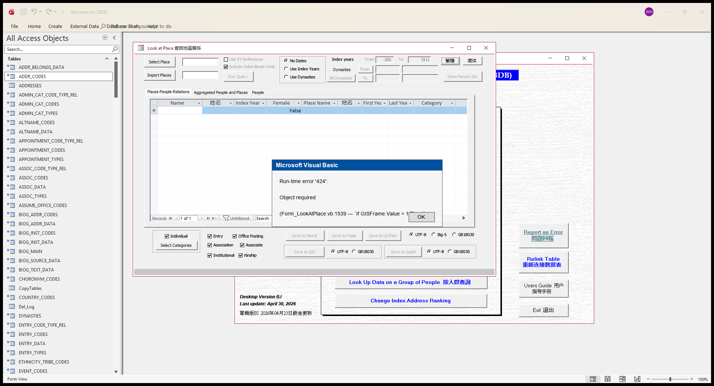

_**Hypothetical** popup, reconstructed in PIL.  Users currently CAN'T trigger this — Bug #15 means the CmdGIS button does not exist on LookAtPlace, so the click that would fire `CmdGIS_Click` (and produce this 'Object required' error) has nowhere to come from.  This image shows what the user would see if a future change restored the CmdGIS button without first fixing the GISFrame → CodeFrame typo on line 1539.  The earlier bug4 step1 / step2 runtime screenshots were misleading (their annotations implied a clickable GIS button) and were removed in PR C — only this faux popup is kept as latent-state evidence._

#### 建議修復方案

把 `Form_LookAtPlace.vb` 第 1539 行的 `GISFrame.Value` 改成 `CodeFrame.Value`。同表單的 `CmdNeo4j_Click`、`CmdGephi_Click`、`CmdPajek_Click` 已經寫對了，可以參考。

### Issue #5 — LookAtStatus.CmdPajek 引用了不存在的控制元件，且 SQL 用了三個不存在的列

**涉及位置:** `Form_LookAtStatus.CmdPajek_Click`

**嚴重等級:** P5 — 潛伏（若先修了 Issue #16 而沒同時修本條，會變成 P1）

#### 問題描述

同一個 handler 裡有兩個相關缺陷：

  (a) 第 2308 行寫 `If ChkIDs.Value Then`，但 Status 上沒有名為 `ChkIDs` 的控制元件——只有 `ChkXYRef`、`ChkKML`、`ChkSubUnits`。

  (b) 第 2335–2338 行構造的 SELECT 引用 `ZZ_SCRATCH_STATUS.c_person_id`、`c_status_id`、`c_status_count`——這三列都不在 schema 裡（真實列名是 `c_personid`、`c_status_code`，count 列根本沒有）。

整段 sub 看起來是從 `LookAtAssociations.CmdPajek_Click` 整段拷過來的，那邊列名都對得上；改名時這兩處都漏了。和 Issue #4 一樣，因為 LookAtStatus 當前也沒有 Pajek 按鈕（Issue #16），使用者暫時碰不到；但只要按鈕加回去而沒先修這兩處，使用者就會立刻看到錯誤。

#### 復現步驟

1. （在 Issue #16 修好之後才能復現）開啟 **LookAtStatus**。
2. 跑一次查詢，然後點 Pajek 按鈕。
3. 第一次會彈 `Object required`（ChkIDs 引用所致）。
4. 如果繞過它，下一次點就會觸發 SQL：因為 SELECT 引用了三個不存在的列，會報 `No such field` 之類的錯誤。

#### 建議修復方案

兩處都要改：
  (a) 把 `ChkIDs.Value` 替換成常量 `False`（如果這個可選行為可以去掉），或者在 LookAtStatus 的設計視圖裡真的加一個 ChkIDs 控制元件。
  (b) 把 SELECT 改成 `ZZ_SCRATCH_STATUS.c_personid` 和 `ZZ_SCRATCH_STATUS.c_status_code`，並去掉對 `c_status_count` 的聚合，或用別的方式計算（源表裡就沒有 c_status_count 列）。

建議整段 sub 通盤重寫而不是單點修補——它顯然是從另一個表單整段複製過來的，列名沒校對過。

### Issue #14 — KIN_DATA 子表單的 CmdPickKinRel 呼叫不存在的 picker（frmPickKINSHIP_CODES）——但目前該子表單在主表中無入口（LATENT）

**涉及位置:** `Form_KIN_DATA_Subform`

**嚴重等級:** P5 — Latent（若日後把 `KIN_DATA Subform` 重新嵌入使用者可達的位置，會回到 P1）

#### 問題描述

**靜態缺陷確實存在，但執行時的觸發路徑當前不可達。**`Form_KIN_DATA_Subform` 第 52 行的 Sub `CmdPickKinRel_Click` 呼叫 `DoCmd.OpenForm "frmPickKINSHIP_CODES"`，並引用 `Forms!frmPickKINSHIP_CODES!frmKINSHIP_CODES.Form!c_kincode`。這兩個表單在目前的 .mdb 都不存在——形狀與 Issue #13 相同。

**為何 LATENT。**承載該按鈕的子表單 `KIN_DATA Subform` （即擁有 `CmdPickKinRel` 按鈕者）在當前的 `control_inventory.json` 裡沒有被任何 active 表單包含。使用者實際從 CBDB_Browser_2 進入的親屬介面是 `BIOG_MAIN_2_Subform`，而它包含的是 `KIN_DATA_2 Subform`（另一個版本，15 個控制元件全是唯讀欄位，沒有 `CmdPickKinRel`按鈕）。唯一仍然嵌入該子表單的位置是 `Form__TMPCLP487951`，那是設計時的備份快照，不是可導航的表單。

因為沒有任何使用者介面能走到那個 picker 按鈕，正常使用下不會彈出錯誤。但只要日後有人把 `KIN_DATA Subform` 重新嵌進可達的位置，這條潛在錯誤路徑就會立刻浮現，所以底層的修復仍值得做。

#### 復現步驟

**建議使用的範例人物：** `c_personid=1`（安惇，An Dun）

開啟人物 1（安惇，An Dun）。KIN_DATA 子資料表會顯示 5 條親屬記錄——點任一條的「kinship code」picker 欄位即可觸發這個有缺陷的 Sub。 _由 `reports/probe_demo_persons.py` 透過 SQL probe 挑選；之所以選這位，是因為其底層記錄數確實滿足這個 bug 的觸發條件。_

1. 驗證路徑**只能靜態驗證**——當前 .mdb 中並無主表單嵌入受影響的子表單，因此無法在執行時重現點選。
2. 靜態證據 (1)：開啟 `analysis/dump/vba/Form_KIN_DATA_Subform.vb` 第 52 行——可見該 Sub 確實呼叫 `DoCmd.OpenForm "frmPickKINSHIP_CODES"`。
3. 靜態證據 (2)：開啟 `analysis/dump/control_inventory.json`，以 `"frmPickKINSHIP_CODES"` 為鍵搜尋——不存在。該 picker 表單已不存在於 .mdb 中。
4. 可達性證據：在同一份 JSON 中搜索 `"KIN_DATA Subform"` 作為 `source_object` 或子表單控制元件名——只有 `Form__TMPCLP487951`（設計時備份快照）引用它。使用者實際走到的 `BIOG_MAIN_2_Subform` 嵌入的是 `KIN_DATA_2 Subform`，那一版沒有 `CmdPickKinRel` 按鈕。

#### 建議修復方案

與 Issue #13 相同：把 picker 表單恢復，或把呼叫方改成指向替代的 picker。雖然目前執行路徑不可達，靜態缺陷仍應清理，以免日後 `KIN_DATA Subform` 被重新嵌入時又冒出來。

### Issue #11 — EVENTS_DATA_2 上 c_event_record_id 控制元件綁到不存在的欄位——但該控制元件本身是隱藏的（LATENT）

**涉及位置:** `EVENTS_DATA_2 Subform`

**嚴重等級:** P5 — Latent（若日後把該控制元件改成 Visible=True 或加寬到 240 twips 以上，就會回到 P2）

#### 問題描述

**靜態缺陷確實存在，但執行時使用者看不到。**EVENTS_DATA_2 子表單上有一個叫 `c_event_record_id` 的控制元件，ControlSource 也是 `c_event_record_id`。EVENTS_DATA 與 `View_EventsData` 都沒有這個欄位（SQL 驗證：`SELECT c_event_record_id FROM View_EventsData` 會拋 `Too few parameters. Expected 1.`）。所以如果該控制元件顯示出來，確實會空白。

**為何 LATENT。**對 runtime 表單做 COM 探測（`analysis/probe_bug_10_11_12_visibility.py`）顯示該控制元件 `Visible = False`，寬 240 twips（~4mm）、高 270 twips——這就是一個隱藏的內部控制元件，幾乎可以肯定是早期殘留的 join-key 欄位，本來就不打算給使用者看。使用者不會看到空白欄位，因為根本看不到這個控制元件。2026-05-03 從 P2 降到 P5。

#### 復現步驟

**建議使用的範例人物：** `c_personid=44872`（孫才，Sun Cai）

開啟人物 44872（孫才，Sun Cai）。EVENTS 子資料表會顯示 1 條事件，其中 1 條有對應地址。相關繫結控制元件在每一列都會顯示空白。 _由 `reports/probe_demo_persons.py` 透過 SQL probe 挑選；之所以選這位，是因為其底層記錄數確實滿足這個 bug 的觸發條件。_

1. 驗證路徑**只能靜態 + COM 探測**——沒有 UI 上的可見徵狀。
2. 靜態證據：對 user mdb 跑 `SELECT c_event_record_id FROM View_EventsData` 會拋 `Too few parameters. Expected 1.`，確認該欄位不在投影裡。
3. 可見性證據：跑 `python analysis/probe_bug_10_11_12_visibility.py`，看 `analysis/dump/bug_10_11_12_visibility.json` 中 bug #11 那筆——`control_summary.visible` 是 `False`、`width` 是 240 twips。

#### 建議修復方案

若這個隱藏控制元件用不到了，直接刪除即可；若原意是隱藏的 join-key 容器，把 ControlSource 改成真實的欄位（例如 `c_event_code`），免得帶著一個失效的繫結。無論怎麼改，使用者都看不到差別——這純粹是程式碼整潔。

### Issue #12 — POSTED_TO_OFFICE_DATA_2 上 c_appt_type_code 控制元件綁到沒投影的欄位——但該控制元件是隱藏的，且使用者實際看的任職型別欄位是正常的（LATENT）

**涉及位置:** `POSTED_TO_OFFICE_DATA_2 Subform`

**嚴重等級:** P5 — Latent（若日後把該控制元件改成 Visible=True 或加寬到 180 twips 以上，就會回到 P2）

#### 問題描述

**靜態缺陷確實存在，但執行時使用者看不到。**POSTED_TO_OFFICE_DATA_2 上隱藏的內部控制元件 `c_appt_type_code` ControlSource 是 `c_appt_type_code`，而 `View_PostingOfficeData` 沒有投影這個欄位（SQL 驗證：拋 `Too few parameters. Expected 1.`）。

**為何 LATENT。** 兩個理由：

1. COM 探測（`analysis/probe_bug_10_11_12_visibility.py`）顯示該控制元件 `Visible = False`，寬 180 twips（~3mm）、高 330 twips——典型的隱藏 join-key 控制元件。
2. 同一個子表單上**真正給使用者看的**任職型別欄位是 `TxtApptType`（綁 `c_appt_desc`）與 `TxtApptTypeChn`（綁 `c_appt_desc_chn`）。這兩個欄位都在 `View_PostingOfficeData` 的投影裡——SQL 探測能拿到真實值（例如 `'Regular Appointment'` / `'正授'`）。所以 Postings 分頁上的任職型別**是正常顯示的**；只有隱藏的 `c_appt_type_code` 控制元件壞掉。

2026-05-03 從 P2 降到 P5——原本「任職型別列每一列都是空白」的 P2 說法是錯的；使用者實際看的任職型別欄位是正常的。

#### 復現步驟

**建議使用的範例人物：** `c_personid=2`（安邡，An Fang）

開啟人物 2（安邡，An Fang）。POSTED-TO-OFFICE 子資料表會顯示 1 條官職任命記錄，c_appt_code 都不為 NULL；但任職型別那一列每一列都是空白。 _由 `reports/probe_demo_persons.py` 透過 SQL probe 挑選；之所以選這位，是因為其底層記錄數確實滿足這個 bug 的觸發條件。_

1. 驗證路徑**只能靜態 + COM 探測**——沒有 UI 上的可見徵狀。
2. 靜態證據：`SELECT c_appt_type_code FROM View_PostingOfficeData` 會拋 `Too few parameters. Expected 1.`，確認該欄位不在投影裡。
3. 可見性證據：跑 `python analysis/probe_bug_10_11_12_visibility.py`，看 `analysis/dump/bug_10_11_12_visibility.json` 中 bug #12 那筆——`control_summary.visible` 是 `False`、width 是 180 twips。
4. 反證（使用者實際看的欄位是正常的）：`SELECT TOP 1 c_appt_desc, c_appt_desc_chn FROM View_PostingOfficeData` 能返回真實值（例如 `'Regular Appointment'` / `'正授'`），這就是 `TxtApptType` / `TxtApptTypeChn`（可見的兩個控制元件）渲染出來的內容。

#### 建議修復方案

若這個隱藏控制元件用不到了，刪除即可；若是有意為之的隱藏 join-key 容器，把 ControlSource 改成真實的欄位（例如 `c_appt_code`）。無論怎麼改，使用者都看不到差別——這純粹是程式碼整潔。

## 附錄 —— c_index_year / c_index_addr_id 與 cbdb-online-main-server 快照之間的偏差（差異需要逐筆分類後才能判定是否為缺陷）

我們把本 .mdb 的 BIOG_MAIN 與 cbdb-online-main-server 每週釋出的 SQLite 快照在 `c_index_year`、`c_index_addr_id` 兩個欄位上做比對，可以看到一小部分人物對不齊。

**兩邊是兩套獨立的實作。**SQLite 快照中的 `c_index_year` 是 cbdb-online-main-server 的 PHP `IndexYearRebuildService.php` 算出來的，`c_index_addr_id` 則是 `IndexAddressRebuildService.php` 算出來的（程式碼都在 <https://github.com/cbdb-project/cbdb-online-main-server>）；User MDB 上對應的這兩個User MDB 那一邊：`c_index_addr_id` 由前端 mdb 裡的 `Form_frmIndexAddr` VBA 重建；`c_index_year` 由連結表後端 `data/CBDB_<YYYYMMDD>_DATA.mdb` 裡 **37 條 `BM IY Rule …` 的 QueryDef** 重建，由 `frmBaseMaintenance` 驅動。兩邊演算法已抽取到 `analysis/dump_data/querydefs_index/*.sql`；form / module 驅動 VBA 仍需 Access SaveAsText 互動式提取。PHP **意圖**映象 VBA，但兩者是兩條獨立的程式路徑。每一行差異**可能**來自下列至少四個原因，光看差異本身分不出來：(1) 源資料快照漂移；(2) PHP 與 VBA 之間的演演算法 / 移植差異；(3) 優先序 / 平手規則不同；(4) null / 預設值處理不同。

**我們並沒有對目前看到的 ~575 / 657 246 筆差異做完整分類。**下方列舉的樣本（目前共 13 筆、3 種分桶，來自 `reports/index_drift_examples.json`）只是**示範**這些差異**長什麼樣**，並非統計上有代表性，是後續逐筆分類的起點，不是結論。

### 分類匯總

比對了兩邊都有的 **657,245** 個 personid（User MDB 共 657,784 筆；SQLite 共 657,478 筆；僅 User MDB 有 539 筆；僅 SQLite 有 233 筆）。

| 分桶 | 筆數 | 佔比 | 含義 |
|---|---:|---:|---|
| `exact_match` | 656,682 | 99.914% | 四個欄位全部一致 |
| `source_drift_index_agrees` | 2 | 0.000% | 源資料有漂移但兩邊 index 都一致 |
| `source_drift_index_diffs_too` | 14 | 0.002% | 源資料有漂移、且至少一個 index 不同 |
| `index_year_only_diff` | 59 | 0.009% | 生年/卒年一致，但只有 c_index_year 不同 —— 待追查 |
| `index_addr_only_diff` | 478 | 0.073% | 生年/卒年一致，但只有 c_index_addr_id 不同 —— 待追查 |
| `index_both_diff` | 10 | 0.002% | 生年/卒年一致，但兩個 index 都不同 —— 複合差異最強訊號 |

淨差異：**563** / 657,245（0.086 %）。其中 **16** 筆能明確歸因於 birthyear / deathyear 的源資料漂移；剩下 **547** 筆需要逐筆追查（可能是 PHP↔VBA 演演算法差異，也可能是本分類器沒有比較的 evidence 表（BIOG_ADDR_DATA / ENTRY_DATA / NIAN_HAO 等）裡的漂移）。完整輸出見 `reports/index_drift_classification.json`，演算法來源指標見 `analysis/index_drift_algorithm_notes.md`。

### 年份差異 —— 逐筆 rule 分類

在 **69** 筆「只有 c_index_year 不一致」的行中，逐筆比對 PR N (`analysis/index_year_rule_comparison.md`) 的runtime-vs-PHP 規則級差異。保守分類如下：

| 分桶 | 筆數 |
|---|---:|
| `php_returned_sentinel` (PHP 寫了 sentinel／溢位值) | 1 |
| `php_did_not_compute` (PHP 沒算出值（覆蓋率缺口）) | 19 |
| `access_did_not_compute` (Access 沒算出值（覆蓋率缺口）) | 7 |
| `iteration_order_diff` (Phase-C 迭代次數不同) | 5 |
| `consistent_within_rule` (多列共享同一 (php_tcode, access_tcode, diff)) | 14 |
| `candidate_algorithm_divergence` (形狀符合 K1 的歷史 hypothesis probe 但無法以單筆證據重建) | 5 |
| `unclassified` (尚未對上任何模式) | 18 |

以上沒有任何一筆被視為已確認的 bug。逐筆輸出見 `reports/index_year_drift_rule_classification.json`。

PR K2 進一步的 triage (`analysis/triage_index_year_drift_groups.py` → `reports/index_year_drift_rule_groups.json`) 把剩下的桶命名清楚：

- `consistent_within_rule` × 14 → 5 個 signature 分組。PR AI + AJ 的逐筆探測推翻了原本的 tie-break 假說：14 筆全是 `source_data_drift_biog_main_or_kin_data_between_sides`（8 筆 BIOG_MAIN birthyear 漂移 + 6 筆 KIN_DATA evidence-pid 漂移）。屬於 PHP-side / SQLite snapshot 的上游資料漂移，並非 CBDB 演演算法差異。
- `unclassified` × 18 → 18 筆已命名，17 筆標為 `blocked_by_runtime_priority_triage_pending`（PR M 已 dump frmBaseMaintenance，原始碼已在 repo；要逐筆判斷哪邊正確仍需走一遍 runtime 的 priority／iteration 順序）。
- `php_did_not_compute` × 19 → 按 Access tcode 分 6 組；最大的是 `access_tcode='05'` × 7（jinshi 進士類的 `candidate_php_entry_code_mapping_gap`）。

### c_index_addr_id 差異 —— 逐筆分類

在 **488** 筆 c_index_addr 差異中（PR G 的 478 `index_addr_only_diff` + 10 `index_both_diff`），逐筆把兩邊的 BIOG_ADDR_DATA 代入「rank-priority + MAX(c_sequence)」演演算法重算，與實際儲存值對照分類：

| 分桶 | 筆數 |
|---|---:|
| `mdb_stale_index_addr` | 412 |
| `mdb_value_php_null` | 47 |
| `same_candidates_diff_winner` | 10 |
| `both_stale_recompute_mismatch` | 10 |
| `both_sides_match_recomputed` | 6 |
| `sqlite_stale_index_addr` | 2 |
| `mdb_null_php_value` | 1 |

以上沒有任何一筆被視為已確認的 bug。412 筆 `mdb_stale_index_addr` 屬於維護週期差異（User MDB 在下次釋出前需要重跑 frmBaseMaintenance）。10 筆 `same_candidates_diff_winner` 是唯一的候選演演算法差異。逐筆輸出見 `reports/index_addr_drift_classification.json`。

PR M（`analysis/dump_data_mdb_vba.py`）從 DATA mdb 抽出了 `frmBaseMaintenance.CmdIndexAddress_Click`。它**沒有**像 PHP 那樣明確 `MAX(c_sequence)` 聚合 —— 在維護週期差異之外，這還是一個候選演演算法差異。建議的 release checklist 緩解步驟：在 User MDB 出貨前先在 DATA mdb 上跑 `CmdIndexYear`，再跑 `CmdIndexAddress`。詳見 `analysis/index_drift_algorithm_notes.md` 中的 "Maintenance trigger path" 段。

### 目前能解釋的 drift 原因

每個 bucket 的成因／證據／信心度／下一步追查都寫在 `analysis/index_drift_cause_analysis.md`。本節只列每個 bucket 的計數和信心度摘要；目前沒有任何 bucket 被列為已確認的 CBDB bug。

**c_index_year 原因桶**

| Bucket | 筆數 | 信心度 |
|---|---:|---|
| `php_returned_sentinel` | 1 | high |
| `php_did_not_compute` | 19 | tcode='05' × 7: supported_by_focused_probe (PR Z).  tcode='11' × 5: medium.  Phase-C tcodes (14/20/2304): medium.  tcode='07' × 1: medium (vestigial-vs-intentional unresolved). |
| `access_did_not_compute` | 7 | medium |
| `iteration_order_diff` | 5 | medium |
| `consistent_within_rule` | 14 | supported_by_focused_probe (PR AI + AJ) |
| `candidate_algorithm_divergence` | 5 | low-medium |
| `blocked_by_runtime_priority_triage_pending` | 17 | low (per-row causes); high (category label) |

**c_index_addr_id 原因桶**

| Bucket | 筆數 | 信心度 |
|---|---:|---|
| `mdb_stale_index_addr` | 412 | high |
| `mdb_value_php_null` | 47 | medium |
| `same_candidates_diff_winner` | 10 | high |
| `both_stale_recompute_mismatch` | 10 | medium-high |
| `both_sides_match_recomputed` | 6 | low-medium |
| `sqlite_stale_index_addr` | 2 | medium |
| `mdb_null_php_value` | 1 | medium-high |

建議優先處理的調查專案（完整列表見 cause-analysis md）：

1. B1 release-process step (CmdIndexYear → CmdIndexAddress before shipping User MDB) —— 可消化 412 筆；工程成本：zero (process change)。
2. B3 secondary tie-break (MIN(c_addr_id)) added to both implementations —— 可消化 10 筆；工程成本：small algorithm tweak per side。
3. A2 tcode 05 entry-code-mapping check — DONE by PR Z (6 mapping gaps + 1 c_year=0 gap; all PHP-side upstream data) —— 可消化 7 筆；工程成本：single SQL probe (already run)。

### 僅 c_index_year 不一致的樣例

**`c_personid = 3501` — 李孝稱 (Li Xiaocheng)**

| 欄位 | 本 .mdb (User MDB) | cbdb-online-main-server 快照 |
|---|---|---|
| `c_index_year` | 1018 | 1028 |
| `c_index_addr_id` | 100658 | 100658 |
| `c_birthyear` | 0 | 0 |
| `c_deathyear` | 0 | 0 |
| `c_index_year_type_code` | 19 | 1912 |
| `c_index_year_source_id` | 19149 | 3479 |

**`c_personid = 16266` — 錢孟回 (Qian Menghui)**

| 欄位 | 本 .mdb (User MDB) | cbdb-online-main-server 快照 |
|---|---|---|
| `c_index_year` | 1004 | 992 |
| `c_index_addr_id` | 12723 | 12723 |
| `c_birthyear` | 0 | 0 |
| `c_deathyear` | 0 | 0 |
| `c_index_year_type_code` | 13 | 0512 |
| `c_index_year_source_id` | 700103 | 3035 |

**`c_personid = 16267` — 錢知雄 (Qian Zhixiong)**

| 欄位 | 本 .mdb (User MDB) | cbdb-online-main-server 快照 |
|---|---|---|
| `c_index_year` | 1034 | 1071 |
| `c_index_addr_id` | 12723 | 12723 |
| `c_birthyear` | 0 | 0 |
| `c_deathyear` | 0 | 0 |
| `c_index_year_type_code` | 1312 | 14 |
| `c_index_year_source_id` | 16266 | 16269 |

### 僅 c_index_addr_id 不一致的樣例

**`c_personid = 1` — 安惇 (An Dun)**

| 欄位 | 本 .mdb (User MDB) | cbdb-online-main-server 快照 |
|---|---|---|
| `c_index_year` | 1042 | 1042 |
| `c_index_addr_id` | 101117 |  |
| `c_birthyear` | 1042 | 1042 |
| `c_deathyear` | 1104 | 1104 |
| `c_index_year_type_code` | 01 | 01 |
| `c_index_year_source_id` |  |  |

**`c_personid = 470` — 金君卿 (Jin Junqing)**

| 欄位 | 本 .mdb (User MDB) | cbdb-online-main-server 快照 |
|---|---|---|
| `c_index_year` | 1012 | 1012 |
| `c_index_addr_id` | 12879 | 12785 |
| `c_birthyear` | 0 | 0 |
| `c_deathyear` | 0 | 0 |
| `c_index_year_type_code` | 05 | 05 |
| `c_index_year_source_id` |  |  |

**`c_personid = 481` — 周秩 (Zhou Zhi)**

| 欄位 | 本 .mdb (User MDB) | cbdb-online-main-server 快照 |
|---|---|---|
| `c_index_year` | 1043 | 1043 |
| `c_index_addr_id` | 100416 | 12785 |
| `c_birthyear` | 0 | 0 |
| `c_deathyear` | 0 | 0 |
| `c_index_year_type_code` | 05 | 05 |
| `c_index_year_source_id` |  |  |

**`c_personid = 485` — 周穜 (Zhou Tong)**

| 欄位 | 本 .mdb (User MDB) | cbdb-online-main-server 快照 |
|---|---|---|
| `c_index_year` | 1046 | 1046 |
| `c_index_addr_id` | 100416 | 12785 |
| `c_birthyear` | 0 | 0 |
| `c_deathyear` | 0 | 0 |
| `c_index_year_type_code` | 05 | 05 |
| `c_index_year_source_id` |  |  |

**`c_personid = 562` — 範沖 (Fan Chong)**

| 欄位 | 本 .mdb (User MDB) | cbdb-online-main-server 快照 |
|---|---|---|
| `c_index_year` | 1067 | 1067 |
| `c_index_addr_id` | 100658 | 13292 |
| `c_birthyear` | 1067 | 1067 |
| `c_deathyear` | 1141 | 1141 |
| `c_index_year_type_code` | 01 | 01 |
| `c_index_year_source_id` |  |  |

### 底層 SOURCE 資料本身不同（生年 / 卒年）的樣例

**`c_personid = 1455` — 沈邈 (Shen Miao)**

| 欄位 | 本 .mdb (User MDB) | cbdb-online-main-server 快照 |
|---|---|---|
| `c_index_year` | 1001 | 1008 |
| `c_index_addr_id` | 12887 | 12887 |
| `c_birthyear` | 1001 | 0 |
| `c_deathyear` | 1047 | 0 |
| `c_index_year_type_code` | 01 | 05 |
| `c_index_year_source_id` |  |  |

**`c_personid = 19149` — 李孝基 (Li Xiaoji)**

| 欄位 | 本 .mdb (User MDB) | cbdb-online-main-server 快照 |
|---|---|---|
| `c_index_year` | 1016 | 1026 |
| `c_index_addr_id` | 100658 | 100658 |
| `c_birthyear` | 1016 | 0 |
| `c_deathyear` | 1076 | 0 |
| `c_index_year_type_code` | 01 | 11 |
| `c_index_year_source_id` |  | 41030 |

## 結語

感謝您抽時間讀完這份報告。以上各條都不緊急，我們把它們集中整理在一起，只是希望方便您在合適的時候逐一處理。

如果對其中任何一條的描述或建議有疑問，歡迎隨時一同討論。本倉庫裡對應的迴歸測試，會在任何一個迴歸標記不再復現時自動從 PASS 翻成 FAIL —— 這是「請調查一下」的訊號，而不是「問題已修復」的自動確認（因為標記不再復現也可能是 fixture / driver 變了，或者是我們當初的分類有誤）。
