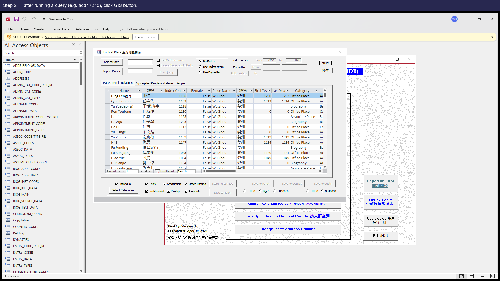
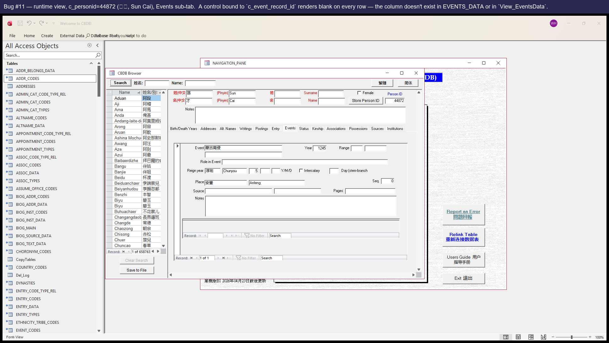
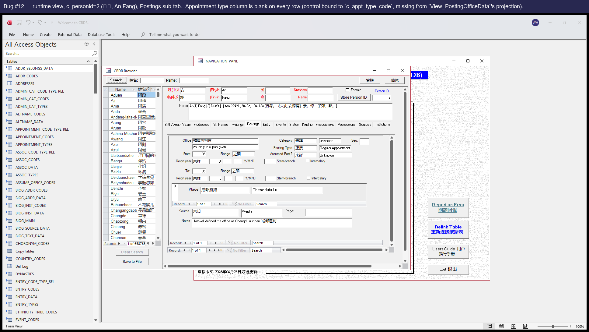

# CBDB 使用者版 .mdb — 問題彙報

_測試過程中發現的問題彙總，謹呈維護團隊斧正。_

尊敬的維護者：

下面是我們在為 CBDB 使用者版 .mdb 編寫自動化迴歸測試套件過程中，陸續整理出來的一些問題清單。我們希望這份報告能在您繼續主持這份寶貴資料集時有所幫助；同時，對您多年來在這套資料上的辛勤付出，我們由衷地表示感謝和敬意。

問題按嚴重程度排序（P0 最高）。每一條都包括：簡明描述、使用者端一步一步的復現步驟、（在介面上能看到時）相關截圖，以及一份建議的修復方案。這些問題並不緊急，整理在此只是為了方便您在合適的時候逐一處理。

## 目錄

- [P0 — 靜默資料錯誤](#p0--靜默資料錯誤)
  - [Issue #1 — View_StatusData 把首年份範圍顯示成了末年份範圍](#issue-1--view_statusdata-把首年份範圍顯示成了末年份範圍)
  - [Issue #3 — LookAtEntry.CmdQuery 的回填 UPDATE 在大結果集上靜默失敗](#issue-3--lookatentrycmdquery-的回填-update-在大結果集上靜默失敗)
  - [Issue #7 — LookAtPlace.CmdNeo4j 在寫入第一條 people-CSV 時靜默失敗](#issue-7--lookatplacecmdneo4j-在寫入第一條-people-csv-時靜默失敗)
  - [Issue #8 — LookAtNetworks.CmdNeo4j 的 people/place CSV 在第一條上靜默失敗](#issue-8--lookatnetworkscmdneo4j-的-peopleplace-csv-在第一條上靜默失敗)
  - [Issue #9 — LookAtEntry.CmdNeo4j 的機構 (Institutions) 部分用錯了記錄集變數](#issue-9--lookatentrycmdneo4j-的機構-institutions-部分用錯了記錄集變數)
- [P1 — 可見的執行時報錯](#p1--可見的執行時報錯)
  - [Issue #4 — LookAtPlace.CmdGIS 報「Object required」（引用了不存在的控制元件）](#issue-4--lookatplacecmdgis-報object-required引用了不存在的控制元件)
  - [Issue #5 — LookAtStatus.CmdPajek 引用了不存在的控制元件，且 SQL 用了三個不存在的列](#issue-5--lookatstatuscmdpajek-引用了不存在的控制元件且-sql-用了三個不存在的列)
  - [Issue #6 — LookAtGroupData 的 ChkEntry 路徑引用了不存在的列 ENTRY_DATA.c_parental_status](#issue-6--lookatgroupdata-的-chkentry-路徑引用了不存在的列-entry_datac_parental_status)
  - [Issue #13 — BIOG_MAIN_2 子表單試圖開啟一個不存在的 picker 表單 (frmPickNIAN_HAO)](#issue-13--biog_main_2-子表單試圖開啟一個不存在的-picker-表單-frmpicknian_hao)
  - [Issue #14 — KIN_DATA 子表單試圖開啟不存在的 picker 表單 (frmPickKINSHIP_CODES)](#issue-14--kin_data-子表單試圖開啟不存在的-picker-表單-frmpickkinship_codes)
- [P2 — 靜默顯示問題](#p2--靜默顯示問題)
  - [Issue #10 — EVENT_ADDR_2 子表單的地址列默默地顯示為空（ControlSource 寫錯了）](#issue-10--event_addr_2-子表單的地址列默默地顯示為空controlsource-寫錯了)
  - [Issue #11 — EVENTS_DATA_2 子表單上有一個控制元件繫結到不存在的列 c_event_record_id](#issue-11--events_data_2-子表單上有一個控制元件繫結到不存在的列-c_event_record_id)
  - [Issue #12 — POSTED_TO_OFFICE_DATA_2 子表單的任職型別控制元件綁到了錯的列名](#issue-12--posted_to_office_data_2-子表單的任職型別控制元件綁到了錯的列名)
- [P3 — 缺失介面](#p3--缺失介面)
  - [Issue #15 — LookAtPlace 缺少 CmdGIS 按鈕（程式碼裡有 handler 但介面上沒控制元件）](#issue-15--lookatplace-缺少-cmdgis-按鈕程式碼裡有-handler-但介面上沒控制元件)
  - [Issue #16 — LookAtStatus 缺少 CmdPajek 按鈕](#issue-16--lookatstatus-缺少-cmdpajek-按鈕)
  - [Issue #17 — LookAtStatus 缺少 CmdGephi 按鈕](#issue-17--lookatstatus-缺少-cmdgephi-按鈕)
  - [Issue #18 — LookAtStatus 缺少 CmdUCINet 按鈕](#issue-18--lookatstatus-缺少-cmducinet-按鈕)
  - [Issue #19 — LookAtOffice 缺少 CmdGUESS 按鈕](#issue-19--lookatoffice-缺少-cmdguess-按鈕)
- [P4 — 安裝設定](#p4--安裝設定)
  - [Issue #2 — VBA 工程引用了過時的 dao360.dll，Office 2016+ 機器上沒這個檔案](#issue-2--vba-工程引用了過時的-dao360dlloffice-2016-機器上沒這個檔案)
- [嚴重等級說明](#嚴重等級說明)
- [附錄 —— c_index_year / c_index_addr_id 與 cbdb-online-main-server 快照之間的偏差（非缺陷）](#附錄--c_index_year--c_index_addr_id-與-cbdb-online-main-server-快照之間的偏差非缺陷)
- [結語](#結語)

## 嚴重等級說明

- P0 — 靜默資料錯誤：資料錯或缺失，但沒有任何報錯提示。
- P1 — 可見的執行時報錯：彈出錯誤對話方塊，操作中斷。
- P2 — 靜默顯示問題：表單欄位本應有資料，卻顯示為空。
- P3 — 缺失介面：程式碼裡實現了某功能，但介面上沒有按鈕去觸發它。
- P4 — 安裝設定：每臺新機器需要一次性處理。

## P0 — 靜默資料錯誤

### Issue #1 — View_StatusData 把首年份範圍顯示成了末年份範圍

**涉及位置:** `View_StatusData`

**嚴重等級:** P0 — 靜默資料錯位

#### 問題描述

存檔查詢 `View_StatusData` 把 `YEAR_RANGE_CODES` 表 JOIN 了兩次（其中一次別名是 `YEAR_RANGE_CODES_1`，用於末年份範圍），但 SELECT 列表裡所有範圍欄位都從 _1 別名取值。結果是 Status 子資料表裡每一行顯示的「首年份範圍」其實是末年份範圍。

#### 復現步驟

⚠ **在當前資料快照下無法在 UI 上復現——請看下方說明**

在當前資料快照下，這個 bug 處於 **潛伏 (dormant) 狀態**——STATUS_DATA 共 70,761 行，但只有 13 行 c_fy_range > 0、0 行 c_ly_range > 0；兩個都有值且不同的只有 0 行。所以目前沒有任何人物能在 UI 上重現這個別名錯位。SQL 缺陷仍然存在；只要未來某次資料更新插入一條 fy/ly range 都填了且不同的 STATUS_DATA 記錄，對應的子資料表那一行就會顯示錯誤文字。今天若要驗證這個 bug，可以直接跑 SQL：
  SELECT c_personid, c_fy_range, c_fy_range_desc, c_ly_range, c_ly_range_desc FROM View_StatusData WHERE c_fy_range > 0 OR c_ly_range > 0;

1. 由於本 .mdb 當前快照下，沒有任何 STATUS_DATA 列同時填了 c_fy_range 和 c_ly_range，這個 bug 暫時無法在 UI 上復現。請直接用 SQL 驗證：
2. 在 Access 裡開啟 .mdb，按 F11 顯示導航窗格，雙擊查詢 **View_StatusData**。
3. 檢視 SELECT 子句：所有 `c_fy_range_*` 別名都從 `YEAR_RANGE_CODES_1` 取值，但 FROM 子句把這個別名 JOIN 在末年份範圍上——這就是錯位。
4. （可選）在 Access 查詢視窗執行 `SELECT TOP 100 c_personid, c_fy_range, c_fy_range_desc, c_ly_range, c_ly_range_desc FROM View_StatusData WHERE c_fy_range > 0 OR c_ly_range > 0` ——未來某次資料更新如果同時填了這兩個欄位且取值不同，每一條結果都會顯示錯誤的首年份文字。

#### 建議修復方案

在 `View_StatusData` 中，把 `YEAR_RANGE_CODES_1.c_range AS c_fy_range_desc` 和 `YEAR_RANGE_CODES_1.c_range_chn AS c_fy_range_chn` 改成不帶別名的 `YEAR_RANGE_CODES.*`（FROM 子句已經按 `c_fy_range` JOIN 了它）。

### Issue #3 — LookAtEntry.CmdQuery 的回填 UPDATE 在大結果集上靜默失敗

**涉及位置:** `Form_LookAtEntry.CmdQuery_Click`

**嚴重等級:** P0 — 靜默資料錯位

#### 問題描述

`Form_LookAtEntry.vb:1778-1789` 用一條 UPDATE 把七張以上 lookup 表 JOIN 到 `ZZ_SCRATCH_ENTRY` 上，回填 `c_entry_desc`、`c_addr_name`、`c_kin_name` 等描述欄位。當結果集足夠大時（大約 30000 行以上），JET 引擎會靜默地不更新這些欄位——使用者看到的查詢結果裡相關列全是空，但完全沒有報錯。這個問題僅在 LookAtEntry 上重現；Status / Texts / Associations 在相近行數下都能正確回填，原因是它們的 UPDATE JOIN 鏈更簡單。

#### 復現步驟

1. 開啟 **LookAtEntry**。
2. 選一個高頻入仕途徑，例如 **36（進士及第）**，不加任何年份或地點篩選。
3. 點 **Run Query**，等查詢跑完。
4. 開啟結果表 `ZZ_SCRATCH_ENTRY`，檢視 `c_entry_desc`、`c_addr_name`、`c_kin_name` 等列。
5. 許多行的描述欄位都是空的，儘管對應的 lookup 行在源表中其實存在。

#### 建議修復方案

把這條龐大的多表 UPDATE 拆成若干條小 UPDATE——每條只 JOIN 一張 lookup 表（UPDATE … LEFT JOIN INDEXYEAR_TYPE_CODES、UPDATE … LEFT JOIN BIOG_MAIN……）。Status / Texts / Associations 已經用這種寫法，執行良好。

### Issue #7 — LookAtPlace.CmdNeo4j 在寫入第一條 people-CSV 時靜默失敗

**涉及位置:** `Form_LookAtPlace.CmdNeo4j_Click`

**嚴重等級:** P0 — 靜默資料缺失（匯出無聲地什麼都沒生成）

#### 問題描述

`LookAtPlace.CmdNeo4j_Click` 中負責生成 People-CSV 的部分（約第 322 行起）用 SELECT 開啟記錄集，但 SELECT 裡只投影了四個 `ZZ_SCRATCH_P_TEXT` 欄位；接下來的寫入迴圈卻試著讀 `!c_dynasty`、`!c_dynasty_chn`、`!c_female`。迴圈一碰到第一行，JET 立即報「集合中找不到專案」（Item not found in this collection）。錯誤處理把它彈了一個 MsgBox 就結束了，所以使用者只看到一個對話方塊，之後整個 Neo4j 匯出鏈下游的任何檔案都不會產生。

#### 復現步驟

1. 開啟 **LookAtPlace**。透過地址 picker 選一個資料量足夠的地址——例如 **c_addr_id = 7213（開封）**——這樣查詢結果有足夠人物餵給 People-CSV 迴圈。點 **Run Query**。
2. 等查詢跑完，點 **Neo4j** 匯出按鈕。
3. 在第一個另存對話方塊（「People 檔」對話方塊）裡選好儲存路徑。
4. 幾乎立刻彈出 `執行時錯誤 3265 ——集合中找不到專案` 對話方塊。
5. 點確定後，剛才選的資料夾裡一個檔案也沒有——整個 Neo4j 匯出什麼都沒寫出。

#### 截圖

_The popup users see (re-rendered for the report; the real popup blocks the COM thread our test driver runs in)._

#### 建議修復方案

把 People-CSV 部分的 SELECT 擴充套件，加入迴圈裡讀到的欄位，例如 `DYNASTIES.c_dynasty`、`DYNASTIES.c_dynasty_chn`、`BIOG_MAIN.c_female`（FROM 子句裡 JOIN 已經把它們暴露出來了）。

### Issue #8 — LookAtNetworks.CmdNeo4j 的 people/place CSV 在第一條上靜默失敗

**涉及位置:** `Form_LookAtNetworks.CmdNeo4j_Click`

**嚴重等級:** P0 — 靜默資料缺失

#### 問題描述

症狀與 Issue #7 相同，只是在另一個表單上。`LookAtNetworks.CmdNeo4j_Click` 中兩條 SELECT 都漏寫了迴圈裡要讀的欄位：

  • `tRstPlace` 的 SELECT（第 2458 行）只投影 3 個欄位，迴圈卻讀 `!x_coord` / `!y_coord`（沒在 SELECT 裡）。
  • `tRstPeoplePlace` 的 SELECT 也漏了 `c_person_id` / `c_index_addr_id`，迴圈要讀它們。

症狀與 Issue #7 完全相同：靜默失敗。

#### 復現步驟

1. 開啟 **LookAtNetworks**（注意：這個表單已知開啟會延遲，請給它幾秒鐘）。
2. 跑一次查詢，然後點 **Neo4j**。
3. 匯出走到 People-with-Place 檔案那一步時，同樣的「Item not found」對話方塊彈出來，之後的檔案都不會再寫了。

#### 建議修復方案

把兩條 SELECT 都擴充套件，加入迴圈裡讀到的欄位。對 tRstPlace 加上 `ADDR_CODES.x_coord`、`ADDR_CODES.y_coord`。對 tRstPeoplePlace 加上 `c_person_id` 和 `c_index_addr_id`。

### Issue #9 — LookAtEntry.CmdNeo4j 的機構 (Institutions) 部分用錯了記錄集變數

**涉及位置:** `Form_LookAtEntry.CmdNeo4j_Click`

**嚴重等級:** P0 — 靜默資料缺失（匯出無聲地什麼都沒生成）

#### 問題描述

`Form_LookAtEntry.vb` 第 1415 行開啟 institutions 記錄集：`Set tRstInstitutions = CurrentDb.OpenRecordset(tQueryStr)`。十行之後，第 1425 行寫的是 `With tRstAssocCodes`，迴圈又讀 `!c_inst_code`、`!c_inst_name_code` 等，依據的卻是早先繫結到 AssocCodes SELECT 的那個 tRstAssocCodes —— 那裡沒有 `c_inst_*`列。症狀與 Issue #7 相同，InstitutionCodes 檔案永遠不會寫出。

注意：這條路徑只在結果集中有 `c_inst_code > 0`（即帶社會機構編碼的入仕記錄）時才會觸發，並非每個 fixture 都會進入這個 With 塊。

#### 復現步驟

1. 用一組會產生「帶社會機構編碼的入仕」的查詢條件開啟 **LookAtEntry**（這種入仕較少見，大多數查詢觸發不到）。
2. 點 **Neo4j**，依次確認每個儲存對話方塊。
3. 走到 InstitutionCodes 檔案這一步時，同樣的「Item not found」對話方塊彈出來。

#### 建議修復方案

把第 1425 行的 `With tRstAssocCodes` 改成 `With tRstInstitutions`。屬於一字之差的筆誤，底層記錄集變數只是寫錯了。

## P1 — 可見的執行時報錯

### Issue #4 — LookAtPlace.CmdGIS 報「Object required」（引用了不存在的控制元件）

**涉及位置:** `Form_LookAtPlace.CmdGIS_Click`

**嚴重等級:** P1 — 可見的報錯，阻塞匯出

#### 問題描述

說明：在當前 .mdb 上這個問題暫時不會被使用者觸發，因為 LookAtPlace的設計視圖裡根本沒有 CmdGIS 按鈕（即 Issue #15）——使用者無法點選。但底層 VBA 問題依然存在：`Form_LookAtPlace.vb` 第 1539 行寫的是 `If GISFrame.Value = 1 Then`，而該表單上根本沒有 `GISFrame` 控制元件（真正的編碼選擇控制元件叫 `CodeFrame`）。一旦 Issue #15 裡把缺失的按鈕加回去而沒先修這一行，每一次點選都會拋錯。

#### 復現步驟

1. （在 Issue #15 修好之後才能復現）開啟 **LookAtPlace**。
2. 跑任意一次查詢。
3. 點 GIS 按鈕。
4. 彈出 `執行時錯誤 424 ——必要的物件（Object required）` 對話方塊，匯出什麼都沒做。

#### 截圖

_Re-rendered popup — exact runtime error users would see if the button were present._

#### 建議修復方案

把 `Form_LookAtPlace.vb` 第 1539 行的 `GISFrame.Value` 改成 `CodeFrame.Value`。同表單的 `CmdNeo4j_Click`、`CmdGephi_Click`、`CmdPajek_Click` 已經寫對了，可以參考。

### Issue #5 — LookAtStatus.CmdPajek 引用了不存在的控制元件，且 SQL 用了三個不存在的列

**涉及位置:** `Form_LookAtStatus.CmdPajek_Click`

**嚴重等級:** P1 — 可見的報錯（兩個相關缺陷）

#### 問題描述

同一個 handler 裡有兩個相關缺陷：

  (a) 第 2308 行寫 `If ChkIDs.Value Then`，但 Status 上沒有名為 `ChkIDs` 的控制元件——只有 `ChkXYRef`、`ChkKML`、`ChkSubUnits`。

  (b) 第 2335–2338 行構造的 SELECT 引用 `ZZ_SCRATCH_STATUS.c_person_id`、`c_status_id`、`c_status_count`——這三列都不在 schema 裡（真實列名是 `c_personid`、`c_status_code`，count 列根本沒有）。

整段 sub 看起來是從 `LookAtAssociations.CmdPajek_Click` 整段拷過來的，那邊列名都對得上；改名時這兩處都漏了。和 Issue #4 一樣，因為 LookAtStatus 當前也沒有 Pajek 按鈕（Issue #16），使用者暫時碰不到；但只要按鈕加回去而沒先修這兩處，使用者就會立刻看到錯誤。

#### 復現步驟

1. （在 Issue #16 修好之後才能復現）開啟 **LookAtStatus**。
2. 跑一次查詢，然後點 Pajek 按鈕。
3. 第一次會彈 `Object required`（ChkIDs 引用所致）。
4. 如果繞過它，下一次點就會觸發 SQL：因為 SELECT 引用了三個不存在的列，會報 `No such field` 之類的錯誤。

#### 建議修復方案

兩處都要改：
  (a) 把 `ChkIDs.Value` 替換成常量 `False`（如果這個可選行為可以去掉），或者在 LookAtStatus 的設計視圖裡真的加一個 ChkIDs 控制元件。
  (b) 把 SELECT 改成 `ZZ_SCRATCH_STATUS.c_personid` 和 `ZZ_SCRATCH_STATUS.c_status_code`，並去掉對 `c_status_count` 的聚合，或用別的方式計算（源表裡就沒有 c_status_count 列）。

建議整段 sub 通盤重寫而不是單點修補——它顯然是從另一個表單整段複製過來的，列名沒校對過。

### Issue #6 — LookAtGroupData 的 ChkEntry 路徑引用了不存在的列 ENTRY_DATA.c_parental_status

**涉及位置:** `Form_LookAtGroupData.queryEntry`

**嚴重等級:** P1 — 常用路徑上的可見報錯（Entry 子查詢）

#### 問題描述

`Form_LookAtGroupData.vb` 第 2621 行的 INSERT INTO 目標列裡寫的是 `c_parental_status_code`，但 SELECT 投影寫的是 `ENTRY_DATA.c_parental_status`（少了 `_code` 字尾）。`ENTRY_DATA` 上真實列名是 `c_parental_status_code`；這個筆誤讓使用者一旦勾上 **Entry** 子型別再點 **Run**，SQL 就會報「無此欄位」。

`Form_LookAtEntry.vb:1650` 寫的是同一段邏輯查詢而且名字是對的，可以參考。

#### 復現步驟

**建議使用的範例人物：** `c_personid=1`（安惇，An Dun）

用人物 1（安惇，An Dun）當匯入清單（資料少、只有 2 條 entry 記錄，方便復現）。在 LookAtGroupData 上只勾 **Entry**，點 **Run**。 _由 `reports/probe_demo_persons.py` 透過 SQL probe 挑選；之所以選這位，是因為其底層記錄數確實滿足這個 bug 的觸發條件。_

1. 在 **LookAtGroupData** 上把匯入清單設為一個人——例如 c_personid = 1（安惇 An Dun），他只有 2 條 ENTRY_DATA 記錄，足以讓有缺陷的 queryEntry SQL 在一個小而熟知的樣本上跑起來。
2. **只**勾 **Entry** 核取方塊（Status / Office / Text / Addr 都不勾，避免無關的查詢分支幹擾）。
3. 點 **Run**。
4. 彈出「欄位不存在」之類的對話方塊（JET 在不同 Office 版本下給出的措辭是「沒有為一個或多個必要引數提供值」或「沒有此欄位」——都是因為 SQL 引用了根本不存在的 `ENTRY_DATA.c_parental_status`）。

#### 建議修復方案

把第 2621 行的 `ENTRY_DATA.c_parental_status` 改成 `ENTRY_DATA.c_parental_status_code`。一行修復。

### Issue #13 — BIOG_MAIN_2 子表單試圖開啟一個不存在的 picker 表單 (frmPickNIAN_HAO)

**涉及位置:** `Form_BIOG_MAIN_2_Subform.c_fl_ey_notes_Click`

**嚴重等級:** P1 — 使用者點選時可見的報錯

#### 問題描述

使用者在某位人物生平詳情子表單上點選 `c_fl_ey_notes` 欄位時，`Sub c_fl_ey_notes_Click` 會呼叫 `DoCmd.OpenForm "frmPickNIAN_HAO"`。.mdb 的 CurrentProject.AllForms 集合中並沒有名為 `frmPickNIAN_HAO` 的表單。Access 報「集合中找不到專案」，使用者的這一次點選就此無效。

可能原因：picker 表單在某次重構中被重新命名或合併了，而這個呼叫處沒有跟著更新。

#### 復現步驟

**建議使用的範例人物：** `c_personid=5`（查籥，Zha Yue）

開啟人物 5（查籥，Zha Yue）。其 `c_fl_ey_notes` 欄位有真實內容（樣例：「紹興二十一年進士。…」），所以點選它會真的觸發這個有缺陷的 Sub。 _由 `reports/probe_demo_persons.py` 透過 SQL probe 挑選；之所以選這位，是因為其底層記錄數確實滿足這個 bug 的觸發條件。_

1. 開啟人物 **c_personid = 5（查籥 Zha Yue）** 的生平詳情——之所以選他，是因為其 BIOG_MAIN 上 `c_fl_ey_notes` 欄位有實際內容，欄位可點（點一個空欄位不會觸發這個 Sub）。
2. 在 BIOG_MAIN_2 子表單上點 `c_fl_ey_notes` 欄位——這會觸發 `c_fl_ey_notes_Click` Sub。
3. 彈出「集合中找不到專案」對話方塊（因為 Sub 試圖 `DoCmd.OpenForm "frmPickNIAN_HAO"`，而該表單根本不存在）。

#### 建議修復方案

要麼把 `frmPickNIAN_HAO` 表單恢復回來，要麼在 `Form_BIOG_MAIN_2_Subform.c_fl_ey_notes_Click` 裡把呼叫改成替代的那個 picker 表單。

### Issue #14 — KIN_DATA 子表單試圖開啟不存在的 picker 表單 (frmPickKINSHIP_CODES)

**涉及位置:** `Form_KIN_DATA_Subform`

**嚴重等級:** P1 — 使用者點選時可見的報錯

#### 問題描述

症狀與 Issue #13 相同，只是在另一個子表單上。KIN_DATA_Subform 中選擇 kinship 編碼的邏輯呼叫 `DoCmd.OpenForm "frmPickKINSHIP_CODES"`，並引用 `Forms!frmPickKINSHIP_CODES!frmKINSHIP_CODES.Form!c_kincode`。這兩個表單當前 .mdb 裡都沒有。

#### 復現步驟

**建議使用的範例人物：** `c_personid=1`（安惇，An Dun）

開啟人物 1（安惇，An Dun）。KIN_DATA 子資料表會顯示 5 條親屬記錄——點任一條的「kinship code」picker 欄位即可觸發這個有缺陷的 Sub。 _由 `reports/probe_demo_persons.py` 透過 SQL probe 挑選；之所以選這位，是因為其底層記錄數確實滿足這個 bug 的觸發條件。_

1. 開啟人物 **c_personid = 1（安惇 An Dun）** 的生平詳情——他有 4 條 KIN_DATA 記錄，足夠用來做一次點選測試。
2. 在 KIN_DATA 子表單上，點任一列的「kinship code」picker 欄位。
3. 彈出「集合中找不到專案」對話方塊（Sub 試圖 `DoCmd.OpenForm "frmPickKINSHIP_CODES"`，該表單也不存在）。

#### 建議修復方案

與 Issue #13 相同：把 picker 表單恢復，或把呼叫方改成指向新的 picker 表單。

## P2 — 靜默顯示問題

### Issue #10 — EVENT_ADDR_2 子表單的地址列默默地顯示為空（ControlSource 寫錯了）

**涉及位置:** `EVENT_ADDR_2 Subform`

**嚴重等級:** P2 — 靜默顯示問題（地址列空白）

#### 問題描述

在 EVENT_ADDR_2 子表單（帶地址的事件）上，兩個地址控制元件的繫結如下：

  • `TxtAddrCHN`.ControlSource = `c_name_chn`
  • `TxtAddrPY`.ControlSource = `c_name`

但該表單的 RecordSource 是存檔查詢 `View_EventAddrData`，裡面把 ADDR_CODES.c_name_chn 起別名成 `c_event_addr_chn`、把 ADDR_CODES.c_name 起別名成 `c_event_addr_name`。投影裡既沒有 `c_name` 也沒有 `c_name_chn`，所以這兩個控制元件每一行都默默地顯示為空。

#### 復現步驟

**建議使用的範例人物：** `c_personid=44872`（孫才，Sun Cai）

開啟人物 44872（孫才，Sun Cai）。EVENTS 子資料表會顯示 1 條事件，其中 1 條有對應地址。相關繫結控制元件在每一列都會顯示空白。 _由 `reports/probe_demo_persons.py` 透過 SQL probe 挑選；之所以選這位，是因為其底層記錄數確實滿足這個 bug 的觸發條件。_

1. 開啟人物 **c_personid = 44872（孫才 Sun Cai）** 的生平詳情——之所以選他，是因為他同時有 EVENTS_DATA 和 EVENTS_ADDR 記錄，數量適中，方便肉眼檢查。
2. 切換到 EVENT_ADDR 子資料表。
3. 中文地址列和拼音地址列每一列都是空白，儘管底層 ADDR_CODES 對應行其實有真實值。

#### 截圖

_EVENT_ADDR_2 in design view, annotated — TxtAddrCHN's ControlSource (`c_name_chn`) is not in the form's RecordSource projection._

#### 建議修復方案

在表單設計視圖裡，把 `TxtAddrCHN`.ControlSource 由 `c_name_chn` 改成 `c_event_addr_chn`，把 `TxtAddrPY`.ControlSource 由 `c_name` 改成 `c_event_addr_name`（這才是 View_EventAddrData 裡真實的別名）。

### Issue #11 — EVENTS_DATA_2 子表單上有一個控制元件繫結到不存在的列 c_event_record_id

**涉及位置:** `EVENTS_DATA_2 Subform`

**嚴重等級:** P2 — 靜默顯示問題（一列空白）

#### 問題描述

EVENTS_DATA_2 子表單上有一個控制元件，其 ControlSource 寫的是 `c_event_record_id`。源表 EVENTS_DATA 和表單的 RecordSource （`View_EventsData`）都沒有這一列——可能是早期 schema 上確實有「event record id」欄位，後來被去掉了，也可能是想寫 `c_event_code` 而打成錯字。該控制元件每一行都默默顯示空白。

#### 復現步驟

**建議使用的範例人物：** `c_personid=44872`（孫才，Sun Cai）

開啟人物 44872（孫才，Sun Cai）。EVENTS 子資料表會顯示 1 條事件，其中 1 條有對應地址。相關繫結控制元件在每一列都會顯示空白。 _由 `reports/probe_demo_persons.py` 透過 SQL probe 挑選；之所以選這位，是因為其底層記錄數確實滿足這個 bug 的觸發條件。_

1. 開啟人物 **c_personid = 44872（孫才 Sun Cai）** 的生平詳情——與上面 Issue #10 同一個人，他有多條 EVENTS_DATA 記錄，每一列都會渲染出問題欄位。
2. 切換到 EVENTS 子資料表。
3. 繫結到 `c_event_record_id` 的控制元件每一列都是空白（因為 EVENTS_DATA 和 View_EventsData 都沒有這個欄位）。

#### 截圖

_EVENTS_DATA_2 in design view, annotated._

#### 建議修復方案

首先確認本意是什麼。如果這一列已經不需要，刪掉控制元件即可；如果原本想綁 `c_event_code`，把 ControlSource 改成它；如果確實需要一個事件記錄 id，那就要在 EVENTS_DATA 上加這一列，並且在 View_EventsData 的 SELECT 裡 project 出來。

### Issue #12 — POSTED_TO_OFFICE_DATA_2 子表單的任職型別控制元件綁到了錯的列名

**涉及位置:** `POSTED_TO_OFFICE_DATA_2 Subform`

**嚴重等級:** P2 — 靜默顯示問題（一列空白）

#### 問題描述

POSTED_TO_OFFICE_DATA_2 子表單上 `c_appt_type_code` 控制元件的 ControlSource 寫的是 `c_appt_type_code`。表單的 RecordSource （`View_PostingOfficeData`）投影的是 `POSTED_TO_OFFICE_DATA.c_appt_code`（中間沒有 `_type`）。控制元件默默地顯示空白。

看起來是某次列重新命名後表單設計沒跟上。

#### 復現步驟

**建議使用的範例人物：** `c_personid=2`（安邡，An Fang）

開啟人物 2（安邡，An Fang）。POSTED-TO-OFFICE 子資料表會顯示 1 條官職任命記錄，c_appt_code 都不為 NULL；但任職型別那一列每一列都是空白。 _由 `reports/probe_demo_persons.py` 透過 SQL probe 挑選；之所以選這位，是因為其底層記錄數確實滿足這個 bug 的觸發條件。_

1. 開啟人物 **c_personid = 2（安邡 An Fang）** 的生平詳情——之所以選他，是因為他有為數不多的 POSTED_TO_OFFICE_DATA 記錄，且每條的 `c_appt_code` 都不為 NULL，這樣我們要檢查的欄位確實有源資料。
2. 切換到 POSTED_TO_OFFICE 子資料表。
3. 任職型別列每一列都是空白，儘管源表 c_appt_code 在每一列都是有值的。

#### 截圖

_POSTED_TO_OFFICE_DATA_2 in design view, annotated._

#### 建議修復方案

把控制元件的 ControlSource 由 `c_appt_type_code` 改成 `c_appt_code`（這才是 View_PostingOfficeData 真正投影出來的列名）。

## P3 — 缺失介面

### Issue #15 — LookAtPlace 缺少 CmdGIS 按鈕（程式碼裡有 handler 但介面上沒控制元件）

**涉及位置:** `LookAtPlace`

**嚴重等級:** P3 — 缺失介面（使用者用不到該功能）

#### 問題描述

`Form_LookAtPlace.vb` 裡定義了一個完整可用的 `CmdGIS_Click` handler——構造並輸出 GIS .tab 檔案，邏輯和 Status / Texts / Associations / Office / Kinship 上的 GIS 按鈕一模一樣。但 LookAtPlace 的設計檢視上根本沒有 `CmdGIS` 按鈕。使用者在 Place 上可以使用 Pajek / Gephi / Neo4j 匯出，但用不了 GIS 匯出——程式碼在那裡，只是介面進不去。

#### 復現步驟

1. 開啟 **LookAtPlace**。
2. 看右下方那一排匯出按鈕。
3. 沒有 GIS 按鈕。可以對比 LookAtStatus / LookAtAssociations / LookAtOffice 等，它們都有這個按鈕。

#### 截圖

_LookAtPlace as it ships — no GIS button is rendered, even though `Sub CmdGIS_Click()` exists in the module._

#### 建議修復方案

在 LookAtPlace 的設計視圖裡，在已有的 CmdPajek / CmdGephi 旁邊加一個 CmdGIS 按鈕，把 `OnClick` 設為 `[Event Procedure]`，這樣它就會呼叫已經寫好的 CmdGIS_Click。（同時務必先修 Issue #4，否則按鈕一點就會報 Object required。）

### Issue #16 — LookAtStatus 缺少 CmdPajek 按鈕

**涉及位置:** `LookAtStatus`

**嚴重等級:** P3 — 缺失介面

#### 問題描述

形態與 Issue #15 相同。`Sub CmdPajek_Click()` 在 `Form_LookAtStatus.vb` 裡有定義（本應輸出 Pajek .net 檔案），但 Status 的設計檢視上沒有 CmdPajek 按鈕。

注意：即便把按鈕加回去，也得先解決 Issue #5（CmdPajek_Click 本身的 SQL/控制元件缺陷）。

#### 復現步驟

1. 開啟 **LookAtStatus**。匯出按鈕一欄只有 GIS 和 Neo4j，沒有 Pajek。

#### 截圖

#### 建議修復方案

在 LookAtStatus 的設計視圖裡加一個 CmdPajek 按鈕（先把 Issue #5 修好）。

### Issue #17 — LookAtStatus 缺少 CmdGephi 按鈕

**涉及位置:** `LookAtStatus`

**嚴重等級:** P3 — 缺失介面

#### 問題描述

`Sub CmdGephi_Click()` 在 `Form_LookAtStatus.vb` 裡有定義，但表單設計視圖裡沒有相應按鈕。

#### 復現步驟

1. 開啟 **LookAtStatus**。沒有 Gephi 匯出按鈕。

#### 截圖

#### 建議修復方案

在 LookAtStatus 的設計視圖裡加一個 CmdGephi 按鈕。

### Issue #18 — LookAtStatus 缺少 CmdUCINet 按鈕

**涉及位置:** `LookAtStatus`

**嚴重等級:** P3 — 缺失介面

#### 問題描述

`Sub CmdUCINet_Click()` 在 `Form_LookAtStatus.vb` 裡有定義，但表單設計視圖裡沒有相應按鈕。

#### 復現步驟

1. 開啟 **LookAtStatus**。沒有 UCINet 匯出按鈕。

#### 截圖

#### 建議修復方案

在 LookAtStatus 的設計視圖裡加一個 CmdUCINet 按鈕。

### Issue #19 — LookAtOffice 缺少 CmdGUESS 按鈕

**涉及位置:** `LookAtOffice`

**嚴重等級:** P3 — 缺失介面

#### 問題描述

`Sub CmdGUESS_Click()` 在 `Form_LookAtOffice.vb` 裡有定義，但 Office 的設計檢視上沒有 CmdGUESS 按鈕。Office 上的使用者可以使用 GIS / GISPeople / Neo4j 匯出，但用不了 GUESS。

#### 復現步驟

1. 開啟 **LookAtOffice**。沒有 GUESS 匯出按鈕。

#### 截圖

#### 建議修復方案

在 LookAtOffice 的設計視圖裡加一個 CmdGUESS 按鈕。

## P4 — 安裝設定

### Issue #2 — VBA 工程引用了過時的 dao360.dll，Office 2016+ 機器上沒這個檔案

**涉及位置:** `VBE Project References`

**嚴重等級:** P4 — 每臺新機器一次性的安裝障礙

#### 問題描述

.mdb 中的 VBA 工程硬性引用了 `C:\Program Files\Common Files\Microsoft Shared\DAO\dao360.dll`，這是 Access 2003 時代 DAO 3.6 的位置。現代 Office（2016 起）改用 `ACEDAO.DLL`，並不會安裝舊版 DLL。在任何全新的現代機器上，第一次嘗試開啟任意 LookAt 表單都會報「找不到工程或庫」（Can't find project or library），對終端使用者來說既看不懂又嚇人。

嚴重等級較低，因為每臺機器只需修一次，但每臺新裝都會撞上。

#### 復現步驟

1. 在全新的現代 Office 機器上安裝 `CBDB_BJ_User.mdb`。
2. 開啟檔案，按 Alt+F11 進入 VBE 編輯器。
3. 工具 → 引用。可以看到一行寫著 `MISSING: dao360.dll`。
4. 開啟任意 LookAt 表單。會彈出「Can't find project or library」錯誤。

#### 建議修復方案

在維護者的機器上做一次：
  1. 用 Access 開啟 .mdb，按 Alt+F11。
  2. 工具 → 引用。取消勾選標著 MISSING 的 dao360.dll。
  3. 勾選 `Microsoft Office 16.0 Access Database Engine Object Library`（即 ACEDAO.DLL）。
  4. 儲存 .mdb。

然後重新分發修好的檔案。以後的終端使用者什麼都不用做。

## 附錄 —— c_index_year / c_index_addr_id 與 cbdb-online-main-server 快照之間的偏差（非缺陷）

我們把本 .mdb 的 BIOG_MAIN 與 cbdb-online-main-server 每週釋出的 SQLite 快照在 `c_index_year`、`c_index_addr_id` 兩個欄位上做比對，可以看到一小部分人物對不齊。我們希望明確說明：這並不是缺陷 —— 兩套管線跑的都是同一段 `IndexYearRebuildService.php` 演算法，只是依據的源資料快照不一樣，下游某些擇優規則也略有出入。

### 僅 c_index_year 不一致的樣例

**`c_personid = 3501` — 李孝稱 (Li Xiaocheng)**

| 欄位 | 本 .mdb (User MDB) | cbdb-online-main-server 快照 |
|---|---|---|
| `c_index_year` | 1018 | 1028 |
| `c_index_addr_id` | 100658 | 100658 |
| `c_birthyear` | 0 | 0 |
| `c_deathyear` | 0 | 0 |
| `c_index_year_type_code` | 19 | 1912 |
| `c_index_year_source_id` | 19149 | 3479 |

**`c_personid = 16266` — 錢孟回 (Qian Menghui)**

| 欄位 | 本 .mdb (User MDB) | cbdb-online-main-server 快照 |
|---|---|---|
| `c_index_year` | 1004 | 992 |
| `c_index_addr_id` | 12723 | 12723 |
| `c_birthyear` | 0 | 0 |
| `c_deathyear` | 0 | 0 |
| `c_index_year_type_code` | 13 | 0512 |
| `c_index_year_source_id` | 700103 | 3035 |

**`c_personid = 16267` — 錢知雄 (Qian Zhixiong)**

| 欄位 | 本 .mdb (User MDB) | cbdb-online-main-server 快照 |
|---|---|---|
| `c_index_year` | 1034 | 1071 |
| `c_index_addr_id` | 12723 | 12723 |
| `c_birthyear` | 0 | 0 |
| `c_deathyear` | 0 | 0 |
| `c_index_year_type_code` | 1312 | 14 |
| `c_index_year_source_id` | 16266 | 16269 |

### 僅 c_index_addr_id 不一致的樣例

**`c_personid = 1` — 安惇 (An Dun)**

| 欄位 | 本 .mdb (User MDB) | cbdb-online-main-server 快照 |
|---|---|---|
| `c_index_year` | 1042 | 1042 |
| `c_index_addr_id` | 101117 |  |
| `c_birthyear` | 1042 | 1042 |
| `c_deathyear` | 1104 | 1104 |
| `c_index_year_type_code` | 01 | 01 |
| `c_index_year_source_id` |  |  |

**`c_personid = 470` — 金君卿 (Jin Junqing)**

| 欄位 | 本 .mdb (User MDB) | cbdb-online-main-server 快照 |
|---|---|---|
| `c_index_year` | 1012 | 1012 |
| `c_index_addr_id` | 12879 | 12785 |
| `c_birthyear` | 0 | 0 |
| `c_deathyear` | 0 | 0 |
| `c_index_year_type_code` | 05 | 05 |
| `c_index_year_source_id` |  |  |

**`c_personid = 481` — 周秩 (Zhou Zhi)**

| 欄位 | 本 .mdb (User MDB) | cbdb-online-main-server 快照 |
|---|---|---|
| `c_index_year` | 1043 | 1043 |
| `c_index_addr_id` | 100416 | 12785 |
| `c_birthyear` | 0 | 0 |
| `c_deathyear` | 0 | 0 |
| `c_index_year_type_code` | 05 | 05 |
| `c_index_year_source_id` |  |  |

**`c_personid = 485` — 周穜 (Zhou Tong)**

| 欄位 | 本 .mdb (User MDB) | cbdb-online-main-server 快照 |
|---|---|---|
| `c_index_year` | 1046 | 1046 |
| `c_index_addr_id` | 100416 | 12785 |
| `c_birthyear` | 0 | 0 |
| `c_deathyear` | 0 | 0 |
| `c_index_year_type_code` | 05 | 05 |
| `c_index_year_source_id` |  |  |

**`c_personid = 562` — 範沖 (Fan Chong)**

| 欄位 | 本 .mdb (User MDB) | cbdb-online-main-server 快照 |
|---|---|---|
| `c_index_year` | 1067 | 1067 |
| `c_index_addr_id` | 100658 | 13292 |
| `c_birthyear` | 1067 | 1067 |
| `c_deathyear` | 1141 | 1141 |
| `c_index_year_type_code` | 01 | 01 |
| `c_index_year_source_id` |  |  |

### 底層 SOURCE 資料本身不同（生年 / 卒年）的樣例

**`c_personid = 1455` — 沈邈 (Shen Miao)**

| 欄位 | 本 .mdb (User MDB) | cbdb-online-main-server 快照 |
|---|---|---|
| `c_index_year` | 1001 | 1008 |
| `c_index_addr_id` | 12887 | 12887 |
| `c_birthyear` | 1001 | 0 |
| `c_deathyear` | 1047 | 0 |
| `c_index_year_type_code` | 01 | 05 |
| `c_index_year_source_id` |  |  |

**`c_personid = 19149` — 李孝基 (Li Xiaoji)**

| 欄位 | 本 .mdb (User MDB) | cbdb-online-main-server 快照 |
|---|---|---|
| `c_index_year` | 1016 | 1026 |
| `c_index_addr_id` | 100658 | 100658 |
| `c_birthyear` | 1016 | 0 |
| `c_deathyear` | 1076 | 0 |
| `c_index_year_type_code` | 01 | 11 |
| `c_index_year_source_id` |  | 41030 |

## 結語

感謝您抽時間讀完這份報告。以上各條都不緊急，我們把它們集中整理在一起，只是希望方便您在合適的時候逐一處理。

如果對其中任何一條的描述或建議有疑問，歡迎隨時一同討論。本倉庫裡對應的迴歸測試，會在您修好任意一個問題、並重新匯出 dump 之後自動從 PASS 翻成 FAIL —— 可以作為修復完成的訊號使用。
